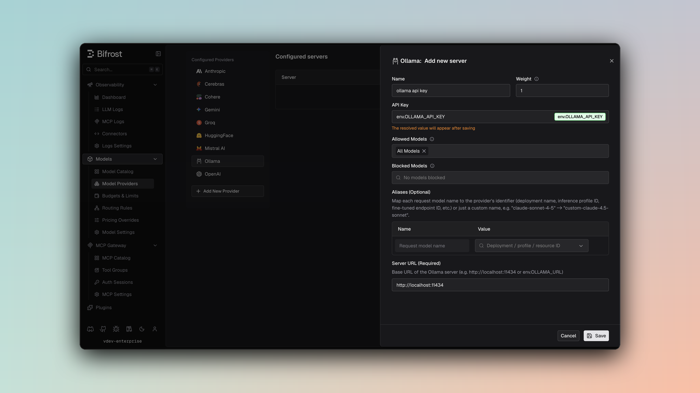

## Overview

Ollama is a **local-first, OpenAI-compatible inference engine** for running large language models on personal computers or servers. Bifrost delegates to the OpenAI implementation while supporting Ollama's unique configuration requirements. Key characteristics:
- **Local-first deployment** - Run models locally or on private infrastructure
- **OpenAI API compatibility** - Identical request/response format
- **Full feature support** - Chat, text, embeddings, and streaming
- **Tool calling** - Complete function definition and execution
- **Self-hosted** - No external API dependency required

### Supported Operations

| Operation | Non-Streaming | Streaming | Endpoint |
|-----------|---------------|-----------|----------|
| Chat Completions | ✅ | ✅ | `/v1/chat/completions` |
| Responses API | ✅ | ✅ | `/v1/chat/completions` |
| Text Completions | ✅ | ✅ | `/v1/completions` |
| Embeddings | ✅ | - | `/v1/embeddings` |
| List Models | ✅ | - | `/v1/models` |
| Image Generation | ❌ | ❌ | - |
| Speech (TTS) | ❌ | ❌ | - |
| Transcriptions (STT) | ❌ | ❌ | - |
| Files | ❌ | ❌ | - |
| Batch | ❌ | ❌ | - |

<Note>
**Unsupported Operations** (❌): Speech, Transcriptions, Files, and Batch are not supported by the upstream Ollama API. These return `UnsupportedOperationError`.

Ollama is self-hosted. Ensure you have an Ollama instance running and configured with the correct BaseURL (e.g., `http://localhost:11434`).
</Note>

---

# 1. Chat Completions

## Request Parameters

Ollama supports all standard OpenAI chat completion parameters. For full parameter reference and behavior, see [OpenAI Chat Completions](/providers/supported-providers/openai#1-chat-completions).

### Filtered Parameters

Removed for Ollama compatibility:
- `prompt_cache_key` - Not supported
- `verbosity` - Anthropic-specific
- `store` - Not supported
- `service_tier` - Not supported

Ollama supports all standard OpenAI message types, tools, responses, and streaming formats. For details on message handling, tool conversion, responses, and streaming, refer to [OpenAI Chat Completions](/providers/supported-providers/openai#1-chat-completions).

---

# 2. Responses API

Converted internally to Chat Completions:

```
ResponsesRequest → ChatRequest → ChatCompletion → ResponsesResponse
```

Same parameter support as Chat Completions.

---

# 3. Text Completions

Ollama supports legacy text completion format:

| Parameter | Mapping |
|-----------|---------|
| `prompt` | Direct pass-through |
| `max_tokens` | max_tokens |
| `temperature`, `top_p` | Direct pass-through |
| `stop` | Stop sequences |

---

# 4. Embeddings

Ollama supports text embeddings:

| Parameter | Notes |
|-----------|-------|
| `input` | Text or array of texts |
| `model` | Embedding model name |
| `encoding_format` | "float" or "base64" |
| `dimensions` | Custom output dimensions (optional) |

Response returns embedding vectors with token usage.

---

# 5. List Models

Lists models currently loaded in Ollama with capabilities and context information.

---

## Unsupported Features

| Feature | Reason |
|---------|--------|
| Speech/TTS | Not offered by Ollama API |
| Transcription/STT | Not offered by Ollama API |
| Batch Operations | Not offered by Ollama API |
| File Management | Not offered by Ollama API |

<Note>
Ollama follows the OpenAI API specification for request format and error handling. Authentication is optional and depends on deployment (no authentication required for local access, optional Bearer token for protected instances).

**Critical**: BaseURL must be explicitly configured pointing to your Ollama instance (e.g., `http://localhost:11434` for local, `https://ollama.example.com` for remote).
</Note>

---

## Setup & Configuration

Configure Ollama as a provider.

<Tabs>
<Tab title="Web UI">



1. Navigate to **Models** > **Model Providers**. Look for **Ollama** under **Configured Providers**. If it is missing, click on **Add New Provider** and select **Ollama**.
2. Click **Add New Server** or edit an existing key.
3. Set a name for your key.
4. Leave **API Key** blank for local servers. If your endpoint requires auth, paste a bearer token directly or use an environment variable.
5. Set **Ollama URL** to `http://localhost:11434` or your remote Ollama endpoint.
6. Set **Allowed Models** to **All Models** (default) or the specific model allowlist you want this key to serve.
7. Save the provider configuration.

</Tab>
<Tab title="config.json">

```json
{
  "providers": {
    "ollama": {
      "keys": [
        {
          "name": "ollama-local",
          "value": "",
          "models": [
            "*"
          ],
          "weight": 1.0,
          "ollama_key_config": {
            "url": "http://localhost:11434"
          }
        }
      ]
    }
  }
}
```

</Tab>
<Tab title="API">
Refer to the API documentation for [Provider Keys Management](https://docs.getbifrost.ai/api-reference/providers/create-a-key-for-a-provider).
</Tab>
<Tab title="Go SDK">

```go
case schemas.Ollama:
    return []schemas.Key{{
        Name:   "ollama-local",
        Value:  *schemas.NewSecretVar(""),
        Models: []string{"*"},
        Weight: 1.0,
        OllamaKeyConfig: &schemas.OllamaKeyConfig{
            URL: *schemas.NewSecretVar("http://localhost:11434"),
        },
    }}, nil
```

</Tab>
</Tabs>

**Environment Setup:**

1. Install Ollama from https://ollama.ai
2. Pull a model:
   ```bash
   ollama pull llama3.1
   ollama pull mistral
   ollama pull neural-chat
   ```
3. Start Ollama server:
   ```bash
   ollama serve
   ```
4. Verify it is running:
   ```bash
   curl http://localhost:11434/api/tags
   ```

---

## Performance Considerations

**Streaming for Large Models:**
For better user experience with large models, use streaming:

```json
{
  "model": "llama3.1:latest",
  "messages": [...],
  "stream": true
}
```

**Token Context:**
Different models have different context windows:
- Llama 3.1 70B: 128K tokens
- Mistral 7B: 32K tokens
- Neural Chat 7B: 8K tokens

**GPU Acceleration:**
Ollama automatically uses GPU if available. For CPU-only, ensure timeout is sufficient.

---

## Popular Models

| Model | Size | Context | Speed |
|-------|------|---------|-------|
| llama3.1:latest | Varies | 128K | Fast |
| mistral:latest | 7B | 32K | Very Fast |
| neural-chat:latest | 7B | 8K | Very Fast |
| orca-mini:latest | 3B | 3K | Very Fast |
| openchat:latest | 7B | 8K | Very Fast |

---

## Caveats

<Accordion title="BaseURL Configuration Required">
**Severity**: High
**Behavior**: BaseURL must be explicitly configured through `ollama_key_config.url` or `network_config.base_url` - no default
**Impact**: Requests fail without proper configuration
**Code**: Requests call `baseURLOrError` before contacting Ollama
</Accordion>

<Accordion title="Cache Control Stripped">
**Severity**: Low
**Behavior**: Cache control directives are removed from messages
**Impact**: Prompt caching features don't work
**Code**: Stripped during JSON marshaling
</Accordion>

<Accordion title="Parameter Filtering">
**Severity**: Low
**Behavior**: OpenAI-specific parameters filtered out
**Impact**: prompt_cache_key, verbosity, store removed
**Code**: filterOpenAISpecificParameters
</Accordion>

<Accordion title="User Field Size Limit">
**Severity**: Low
**Behavior**: User field > 64 characters silently dropped
**Impact**: Longer user identifiers are lost
**Code**: SanitizeUserField enforces 64-char max
</Accordion>
