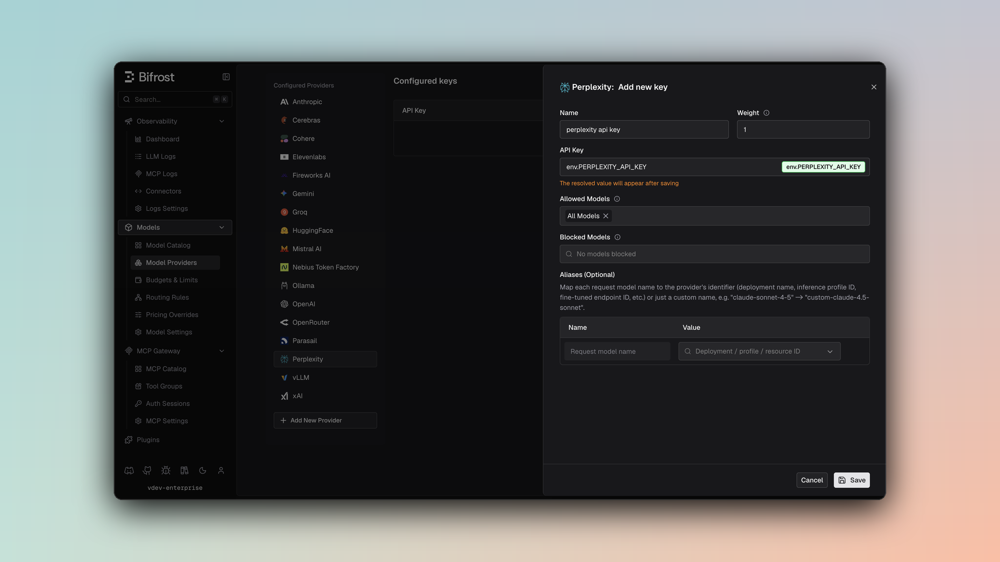

## Overview

Perplexity is an OpenAI-compatible API with built-in web search capabilities and reasoning support. Bifrost performs conversions including:
- **OpenAI-compatible base** - Uses OpenAI's chat format as foundation
- **Web search parameters** - Search mode, domain filters, recency filters, and location-based search
- **Reasoning effort mapping** - `reasoning.effort` mapped to Perplexity's `reasoning_effort` with special handling for "minimal"
- **Search results inclusion** - Citations, search results, and videos included in response
- **Special usage tracking** - Citation tokens, search queries, and reasoning tokens tracked separately
- **Agent API** - The Responses operation doubles as Perplexity's [Agent API](#3-agent-api-perplexitys-sonar-replacement) (presets, `sandbox`/`fetch_url`/`mcp`/`finance_search`/`people_search` tools, multi-turn via `previous_response_id`)

<Note>
Perplexity is retiring the Sonar API (Chat Completions) on **September 27, 2026** in favor of the Agent API. See [Perplexity's migration guide](https://docs.perplexity.ai/docs/agent-api/migrate-from-sonar/overview). Bifrost's Responses operation already speaks the Agent API wire format — see the [Agent API section](#3-agent-api-perplexitys-sonar-replacement) below.
</Note>

### Supported Operations

| Operation | Non-Streaming | Streaming | Endpoint |
|-----------|---------------|-----------|----------|
| Chat Completions | ✅ | ✅ | `/chat/completions` |
| Responses API / Agent API | ✅ | ✅ | `/v1/responses` (Agent API alias); falls back to `/chat/completions` for `sonar-*` models |
| Text Completions | ❌ | ❌ | - |
| Embeddings | ❌ | ❌ | - |
| Image Generation | ❌ | ❌ | - |
| Speech (TTS) | ❌ | ❌ | - |
| Transcriptions (STT) | ❌ | ❌ | - |
| Files | ❌ | ❌ | - |
| Batch | ❌ | ❌ | - |
| List Models | ❌ | ❌ | - |

<Note>
**Unsupported Operations** (❌): Text Completions, Embeddings, Image Generation, Speech, Transcriptions, Files, Batch, and List Models are not supported by the upstream Perplexity API. These return `UnsupportedOperationError`.
</Note>

## Setup & Configuration

Configure Perplexity as a provider.

<Tabs>
<Tab title="Web UI">



1. Navigate to **Models** > **Model Providers**. Look for **Perplexity** under **Configured Providers**. If it is missing, click on **Add New Provider** and select **Perplexity**.
2. Click **Add Key** or edit an existing key.
3. Set a name for your key.
4. Paste your API key directly or use an environment variable (for example, `env.PERPLEXITY_API_KEY`).
5. Set **Allowed Models** to **All Models** (default) or the specific model allowlist you want this key to serve.
6. Save the provider configuration.

</Tab>
<Tab title="config.json">

```json
{
  "providers": {
    "perplexity": {
      "keys": [
        {
          "name": "perplexity-key-1",
          "value": "env.PERPLEXITY_API_KEY",
          "models": [
            "*"
          ],
          "weight": 1.0
        }
      ]
    }
  }
}
```

</Tab>
<Tab title="API">
Refer to the API documentation for [Provider Keys Management](https://docs.getbifrost.ai/api-reference/providers/create-a-key-for-a-provider).
</Tab>
<Tab title="Go SDK">

```go
case schemas.Perplexity:
    return []schemas.Key{{
        Name:   "perplexity-key-1",
        Value:  *schemas.NewSecretVar("env.PERPLEXITY_API_KEY"),
        Models: []string{"*"},
        Weight: 1.0,
    }}, nil
```

</Tab>
</Tabs>

---

# 1. Chat Completions

## Request Parameters

Perplexity supports most OpenAI chat completion parameters. For standard parameter reference, see [OpenAI Chat Completions](/providers/supported-providers/openai#1-chat-completions).

### Perplexity-Specific Constraints

- **No function calling**: `tools` and `tool_choice` are silently dropped
- **Dropped parameters**: `stop`, `logit_bias`, `logprobs`, `top_logprobs`, `seed`, `parallel_tool_calls`, `service_tier`
- **Reasoning**: Uses `reasoning_effort` instead of `reasoning` object (see [Reasoning & Effort](#reasoning--effort))

### Perplexity-Specific Parameters

Use `extra_params` (SDK) or pass directly in request body (Gateway) for Perplexity-specific search and configuration fields:

<Tabs>
<Tab title="Gateway">

```bash
curl -X POST http://localhost:8080/v1/chat/completions \
  -H "Content-Type: application/json" \
  -d '{
    "model": "sonar",
    "messages": [{"role": "user", "content": "What is the latest news?"}],
    "search_mode": "web",
    "language_preference": "en",
    "return_images": true,
    "return_related_questions": true,
    "disable_search": false,
    "search_domain_filter": ["news.example.com"],
    "search_recency_filter": "week"
  }'
```

</Tab>
<Tab title="Go SDK">

```go
resp, err := client.ChatCompletionRequest(schemas.NewBifrostContext(ctx, schemas.NoDeadline), &schemas.BifrostChatRequest{
    Provider: schemas.Perplexity,
    Model:    "sonar",
    Input:    messages,
    Params: &schemas.ChatParameters{
        ExtraParams: map[string]interface{}{
            "search_mode": "web",
            "language_preference": "en",
            "return_images": true,
            "return_related_questions": true,
            "disable_search": false,
            "search_domain_filter": []string{"news.example.com"},
            "search_recency_filter": "week",
        },
    },
})
```

</Tab>
</Tabs>

#### Search Parameters

| Parameter | Type | Description |
|-----------|------|-------------|
| `search_mode` | string | Search mode: `"web"`, `"academic"`, `"news"`, etc. |
| `language_preference` | string | Language preference (e.g., `"en"`, `"fr"`) |
| `search_domain_filter` | string[] | Restrict search to specific domains |
| `return_images` | boolean | Include images in search results |
| `return_related_questions` | boolean | Return related questions |
| `search_recency_filter` | string | Recency filter: `"hour"`, `"day"`, `"week"`, `"month"`, `"year"` |
| `search_after_date_filter` | string | Search results after date (ISO format) |
| `search_before_date_filter` | string | Search results before date (ISO format) |
| `last_updated_after_filter` | string | Content last updated after date |
| `last_updated_before_filter` | string | Content last updated before date |
| `disable_search` | boolean | Disable web search entirely |
| `enable_search_classifier` | boolean | Enable search classifier |
| `top_k` | integer | Top-k results to use |

#### Media Parameters

| Parameter | Type | Description |
|-----------|------|-------------|
| `web_search_options` | object[] | Array of web search option configurations with user location support |
| `media_response.overrides.return_videos` | boolean | Return videos in results |
| `media_response.overrides.return_images` | boolean | Return images in results |

### Web Search Options

Configure detailed search behavior including location:

```json
{
  "web_search_options": [
    {
      "search_context_size": "high",
      "user_location": {
        "latitude": 40.7128,
        "longitude": -74.0060,
        "city": "New York",
        "country": "US",
        "region": "NY"
      },
      "image_search_relevance_enhanced": true
    }
  ]
}
```

## Reasoning & Effort

### Parameter Mapping

- `reasoning.effort` → `reasoning_effort`
- Supported efforts: `"low"`, `"medium"`, `"high"`
- Special conversion: `"minimal"` → `"low"` (Perplexity normalizes to low/medium/high)
- `reasoning.max_tokens` is silently dropped (Perplexity doesn't support token budget control)

### Example

```json
// Request
{"reasoning": {"effort": "high"}}

// Perplexity conversion
{"reasoning_effort": "high"}

// Special case: "minimal" effort
{"reasoning": {"effort": "minimal"}}
→ {"reasoning_effort": "low"}
```

## Response Conversion

### Search Results Inclusion

Perplexity responses include additional fields for search integration:

- `citations[]` - Source citations from search
- `search_results[]` - Full search results with metadata
- `videos[]` - Video results from search

These fields are preserved in the Bifrost response for client use.

### Usage Details

Extended usage tracking specific to Perplexity:

| Field | Source | Description |
|-------|--------|-------------|
| `completion_tokens_details.citation_tokens` | `usage.citation_tokens` | Tokens used for citations |
| `completion_tokens_details.num_search_queries` | `usage.num_search_queries` | Number of web search queries performed |
| `completion_tokens_details.reasoning_tokens` | `usage.reasoning_tokens` | Tokens consumed by reasoning process |
| `usage.cost` | `usage.cost` | Cost of the request |

### Example Response

```json
{
  "id": "...",
  "choices": [...],
  "usage": {
    "prompt_tokens": 100,
    "completion_tokens": 150,
    "total_tokens": 250,
    "completion_tokens_details": {
      "citation_tokens": 25,
      "num_search_queries": 3,
      "reasoning_tokens": 40
    },
    "cost": { "prompt_cost": 0.001, "completion_cost": 0.002 }
  },
  "citations": ["https://example.com/article1", "https://example.com/article2"],
  "search_results": [
    {
      "title": "...",
      "url": "...",
      "snippet": "...",
      "date": "2025-01-15"
    }
  ],
  "videos": [
    {
      "title": "...",
      "url": "...",
      "duration": 300
    }
  ]
}
```

## Streaming

Perplexity uses OpenAI-compatible streaming format. Event sequence:
- `chat.completion.chunk` events with delta updates
- Standard OpenAI finish reason mapping

<Note>
Streaming with web search may return search results in final chunks.
</Note>

---

## Caveats

<Accordion title="No Tool Support">
**Severity**: High
**Behavior**: Tool-related parameters are silently dropped
**Impact**: Function calling not available
**Code**: `chat.go:8-36`
</Accordion>

<Accordion title="Reasoning Effort Mapping">
**Severity**: Medium
**Behavior**: `"minimal"` effort is mapped to `"low"` (Perplexity only supports low/medium/high)
**Impact**: Requested minimal effort becomes low effort
**Code**: `chat.go:30-36`, `responses.go:25-30`
</Accordion>

<Accordion title="Reasoning Max Tokens Dropped">
**Severity**: Low
**Behavior**: `reasoning.max_tokens` is silently dropped
**Impact**: No control over reasoning token budget
**Code**: `chat.go:29-36`
</Accordion>

<Accordion title="Stop Sequences Not Supported">
**Severity**: Low
**Behavior**: `stop` parameter is silently dropped
**Impact**: Stop sequences not enforced
**Code**: `chat.go:8-36`
</Accordion>

---

# 2. Responses API

The Responses API is adapted for Perplexity by converting to the Chat Completions format internally and returning results in Responses format.

## Request Parameters

### Parameter Mapping

| Parameter | Transformation |
|-----------|----------------|
| `max_output_tokens` | Direct pass-through to `max_tokens` |
| `temperature`, `top_p` | Direct pass-through |
| `instructions` | Converted to system message (prepended) |
| `reasoning.effort` | Mapped to `reasoning_effort` (see [Reasoning & Effort](#reasoning--effort)) |
| `text.format` | Passed through as `response_format` |
| `input` (string/array) | Converted to messages |

### Extra Parameters

Same Perplexity-specific search and configuration parameters as Chat Completions (see [Perplexity-Specific Parameters](#perplexity-specific-parameters)).

<Tabs>
<Tab title="Gateway">

```bash
curl -X POST http://localhost:8080/v1/responses \
  -H "Content-Type: application/json" \
  -d '{
    "model": "sonar",
    "instructions": "You are a helpful assistant with web search capabilities",
    "input": "What is the latest news in technology?",
    "search_mode": "news",
    "return_images": true
  }'
```

</Tab>
<Tab title="Go SDK">

```go
resp, err := client.ResponsesRequest(schemas.NewBifrostContext(ctx, schemas.NoDeadline), &schemas.BifrostResponsesRequest{
    Provider: schemas.Perplexity,
    Model:    "sonar",
    Input:    messages,
    Params: &schemas.ResponsesParameters{
        Instructions: schemas.Ptr("You are a helpful assistant with web search capabilities"),
        ExtraParams: map[string]interface{}{
            "search_mode": "news",
            "return_images": true,
        },
    },
})
```

</Tab>
</Tabs>

## Conversion Details

- `instructions` becomes a system message prepended to input messages
- `input` (string or array) converted to user message(s)
- Response converted to Responses API format with same search results and extended usage details

## Response Format

Same as Chat Completions with search results, citations, and extended usage tracking preserved.

## Streaming

Responses streaming uses the same OpenAI-compatible streaming as Chat Completions, with results adapted to Responses format.

---

# 3. Agent API (Perplexity's Sonar replacement)

Perplexity's [Agent API](https://docs.perplexity.ai/docs/agent-api/quickstart) is the successor to Sonar, reachable through the same `/v1/responses` endpoint Bifrost already uses for the Responses operation (documented by Perplexity as the OpenAI-SDK-compatible alias for its native `/v1/agent` endpoint). Sending a Bifrost `responses.create` call to Perplexity with a model that isn't `sonar-*`-suffixed (see the routing caveat below) reaches the Agent API directly — no separate operation or endpoint is needed.

<Note>
Sonar (`sonar`, `sonar-pro`, `sonar-reasoning[-pro]`, `sonar-deep-research`) remains available and unaffected through Chat Completions until Perplexity's September 27, 2026 deprecation date.
</Note>

## Presets and Agent-only Parameters

The Agent API replaces `model` selection with `preset` values (`fast`, `low`, `medium`, `high`, `xhigh`, `wide-research`), and adds `max_steps` to bound the agent's tool-call loop. Neither has a dedicated field in Bifrost's neutral request schema — forward them via `extra_params` (SDK) or directly in the request body (Gateway), the same way Perplexity-specific Sonar search parameters are already passed:

<Tabs>
<Tab title="Gateway">

```bash
curl -X POST http://localhost:8080/v1/responses \
  -H "Content-Type: application/json" \
  -d '{
    "model": "openai/gpt-5.6-sol",
    "input": "What is NVIDIA trading at right now?",
    "preset": "high",
    "max_steps": 5,
    "tools": [{"type": "web_search"}, {"type": "finance_search"}]
  }'
```

</Tab>
<Tab title="Go SDK">

```go
resp, err := client.ResponsesRequest(schemas.NewBifrostContext(ctx, schemas.NoDeadline), &schemas.BifrostResponsesRequest{
    Provider: schemas.Perplexity,
    Model:    "openai/gpt-5.6-sol",
    Input:    messages,
    Params: &schemas.ResponsesParameters{
        ExtraParams: map[string]interface{}{
            "preset":    "high",
            "max_steps": 5,
        },
        Tools: []schemas.ResponsesTool{
            {Type: schemas.ResponsesToolTypeWebSearch},
            {Type: schemas.ResponsesToolTypeFinanceSearch},
        },
    },
})
```

</Tab>
</Tabs>

Bifrost's Perplexity provider always forwards `extra_params` for this operation — unlike most other providers, no `x-bf-passthrough-extra-params` header or context flag is needed.

## Tools

| Tool `type` | Support | Notes |
|-------------|---------|-------|
| `web_search` | ✅ Extended | `filters.search_domain_filter`, `filters.search_recency_filter`, `filters.search_after_date_filter`, `filters.search_before_date_filter`, `filters.last_updated_after_filter`, `filters.last_updated_before_filter`, plus top-level `max_results`, `max_tokens`, `max_tokens_per_page` on `schemas.ResponsesToolWebSearch` / `ResponsesToolWebSearchFilters` |
| `fetch_url` | ✅ | `schemas.ResponsesToolTypeFetchURL` / `ResponsesToolFetchURL{MaxURLs}` |
| `sandbox` | ✅ | `schemas.ResponsesToolTypeSandbox` (no configurable fields; code execution is driven by the prompt) |
| `mcp` | ✅ | Already covered by Bifrost's generic `schemas.ResponsesToolMCP` (server_label, server_url, authorization, allowed_tools, defer_loading all match Perplexity's wire fields) |
| `finance_search` | ✅ | `schemas.ResponsesToolTypeFinanceSearch` (no configurable fields) |
| `people_search` | ✅ | `schemas.ResponsesToolTypePeopleSearch` / `ResponsesToolPeopleSearch{MaxTokens, MaxTokensPerPage}` |
| `function` | ✅ | Already covered by Bifrost's generic `schemas.ResponsesToolFunction` |

## Multi-turn Conversations

Use `previous_response_id` (already a first-class field on `schemas.ResponsesParameters`) to continue a conversation without resending history — set `store: true` on the initial request so it can be referenced later.

## Response Output Items

The Agent API appends tool results as flat items in the `output` array rather than call/output pairs. Bifrost preserves these Perplexity-only item types verbatim so nothing is dropped, but does not yet expose typed Go accessors for their fields — parse the item's raw JSON if you need structured access (`queries`/`results` etc.):

| Output item `type` | Produced by |
|---------------------|-------------|
| `search_results` | `web_search` |
| `fetch_url_results` | `fetch_url` |
| `sandbox_results` | `sandbox` |
| `finance_results` | `finance_search` |
| `people_search_results` | `people_search` |
| `skill_loaded` | Observed alongside `finance_search` results (`{"name":"finance"}`); undocumented by Perplexity at the time this was added |

## Routing Caveat

Models whose name has a `sonar-` prefix (`sonar-pro`, `sonar-reasoning`, `sonar-reasoning-pro`, `sonar-deep-research`) are routed to `/chat/completions` even through the Responses operation, so Agent-only features (`preset`, `max_steps`, the tools above) aren't reachable with those model names — live-verified: `/v1/responses` rejects both `sonar-pro` and `perplexity/sonar-pro` with `model "..." is not supported`. Use the bare `sonar` model or a third-party model Perplexity's Agent API hosts (e.g. `openai/gpt-5.6-sol`) to reach the Agent API directly.

<Note>
Perplexity's own bare `sonar` model requires the `perplexity/` vendor-namespace prefix on `/v1/responses` specifically (`{"model":"sonar",...}` 400s; `{"model":"perplexity/sonar",...}` succeeds) — third-party Agent API models like `openai/gpt-5.6-sol` don't need this. Bifrost rewrites this automatically on the wire, so requesting the `sonar` model just works.
</Note>
