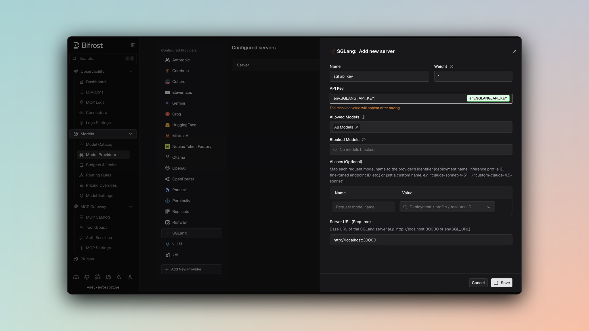

## Overview

SGL (SGLang) is an **OpenAI-compatible local/remote inference engine** used for serving models with high throughput. Bifrost delegates all operations to the OpenAI provider implementation. Key features:
- **OpenAI API compatibility** - Identical request/response format
- **Full streaming support** - Server-Sent Events with usage tracking
- **Tool calling** - Complete function definition and execution
- **Text embeddings** - Support for embedding models
- **Parameter filtering** - Removes unsupported fields for compatibility

### Supported Operations

| Operation | Non-Streaming | Streaming | Endpoint |
|-----------|---------------|-----------|----------|
| Chat Completions | ✅ | ✅ | `/v1/chat/completions` |
| Responses API | ✅ | ✅ | `/v1/chat/completions` |
| Text Completions | ✅ | ✅ | `/v1/completions` |
| Embeddings | ✅ | - | `/v1/embeddings` |
| List Models | ✅ | - | `/v1/models` |
| Image Generation | ❌ | ❌ | - |
| Speech (TTS) | ❌ | ❌ | - |
| Transcriptions (STT) | ❌ | ❌ | - |
| Files | ❌ | ❌ | - |
| Batch | ❌ | ❌ | - |

<Note>
**Unsupported Operations** (❌): Speech, Transcriptions, Files, and Batch are not supported by the upstream SGL API. These return `UnsupportedOperationError`.

SGL is typically self-hosted. Ensure BaseURL is configured correctly pointing to your SGL instance (e.g., `http://localhost:8000`).
</Note>

## Setup & Configuration

Configure SGLang as a provider.

<Tabs>
<Tab title="Web UI">



1. Navigate to **Models** > **Model Providers**. Look for **SGLang** under **Configured Providers**. If it is missing, click on **Add New Provider** and select **SGLang**.
2. Click **Add New Server** or edit an existing key.
3. Set a name for your key.
4. Leave **API Key** blank for local servers. If your endpoint requires auth, paste a bearer token directly or use an environment variable.
5. Set **SGLang URL** to `http://localhost:8000` or your remote SGLang endpoint.
6. Set **Allowed Models** to **All Models** (default) or the specific model allowlist you want this key to serve.
7. Save the provider configuration.

</Tab>
<Tab title="config.json">

```json
{
  "providers": {
    "sgl": {
      "keys": [
        {
          "name": "sgl-local",
          "value": "",
          "models": [
            "*"
          ],
          "weight": 1.0,
          "sgl_key_config": {
            "url": "http://localhost:8000"
          }
        }
      ]
    }
  }
}
```

</Tab>
<Tab title="API">
Refer to the API documentation for [Provider Keys Management](https://docs.getbifrost.ai/api-reference/providers/create-a-key-for-a-provider).
</Tab>
<Tab title="Go SDK">

```go
case schemas.SGL:
    return []schemas.Key{{
        Name:   "sgl-local",
        Value:  *schemas.NewSecretVar(""),
        Models: []string{"*"},
        Weight: 1.0,
        SGLKeyConfig: &schemas.SGLKeyConfig{
            URL: *schemas.NewSecretVar("http://localhost:8000"),
        },
    }}, nil
```

</Tab>
</Tabs>

---

# 1. Chat Completions

## Request Parameters

SGL supports all standard OpenAI chat completion parameters. For full parameter reference and behavior, see [OpenAI Chat Completions](/providers/supported-providers/openai#1-chat-completions).

### Filtered Parameters

Removed for SGL compatibility:
- `prompt_cache_key` - Not supported
- `verbosity` - Anthropic-specific
- `store` - Not supported
- `service_tier` - OpenAI-specific

SGL supports all standard OpenAI message types, tools, responses, and streaming formats. For details on message handling, tool conversion, responses, and streaming, refer to [OpenAI Chat Completions](/providers/supported-providers/openai#1-chat-completions).

---

# 2. Responses API

Fallback to Chat Completions with format conversion:

```
ResponsesRequest → ChatRequest → Response conversion
```

Same parameter support as Chat Completions.

---

# 3. Text Completions

SGL supports legacy text completion format:

| Parameter | Mapping |
|-----------|---------|
| `prompt` | Direct pass-through |
| `max_tokens` | max_tokens |
| `temperature`, `top_p` | Direct pass-through |
| `frequency_penalty`, `presence_penalty` | Supported |

---

# 4. Embeddings

SGL supports text embeddings for vector generation:

| Parameter | Notes |
|-----------|-------|
| `input` | Text or array of texts |
| `model` | Embedding model name |
| `encoding_format` | "float" or "base64" |
| `dimensions` | Model-specific dimension count |

Response returns embedding vectors with usage information.

---

# 5. List Models

Lists available models from SGL server with capabilities.

---

## Unsupported Features

| Feature | Reason |
|---------|--------|
| Speech/TTS | Not offered by SGL API |
| Transcription/STT | Not offered by SGL API |
| Batch Operations | Not offered by SGL API |
| File Management | Not offered by SGL API |

---

<Note>
SGL requires BaseURL configuration pointing to your SGL instance (e.g., `http://localhost:8000` for local, `https://sgl.example.com` for remote).
</Note>

## Caveats

<Accordion title="BaseURL Configuration Required">
**Severity**: High
**Behavior**: BaseURL must be explicitly configured through `sgl_key_config.url` or `network_config.base_url`
**Impact**: Requests fail without proper configuration
**Code**: Requests call `baseURLOrError` before contacting SGL
</Accordion>

<Accordion title="Cache Control Stripped">
**Severity**: Medium
**Behavior**: Cache control directives are removed from messages
**Impact**: Prompt caching features don't work
**Code**: Stripped during JSON marshaling
</Accordion>

<Accordion title="Parameter Filtering">
**Severity**: Low
**Behavior**: OpenAI-specific fields filtered out
**Impact**: prompt_cache_key, verbosity, store removed
**Code**: filterOpenAISpecificParameters
</Accordion>

<Accordion title="User Field Size Limit">
**Severity**: Low
**Behavior**: User field > 64 characters silently dropped
**Impact**: Longer user identifiers are lost
**Code**: SanitizeUserField enforces 64-char max
</Accordion>
