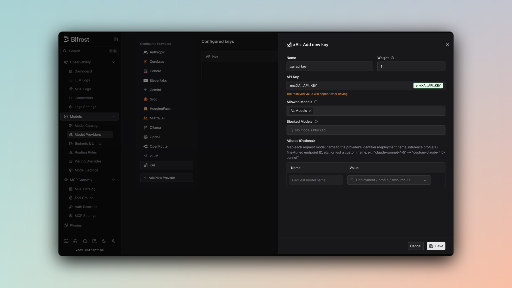

## Overview

xAI is an **OpenAI-compatible provider** powering the Grok family of models. Bifrost delegates to the OpenAI implementation with standard parameter filtering. Key features:
- **Full OpenAI compatibility** - Chat, text completion, and responses
- **Vision support** - Image URLs and base64 encoding for multimodal models
- **Streaming support** - Server-Sent Events with delta-based updates
- **Reasoning support** - Extended thinking for Grok reasoning models
- **Tool calling** - Complete function definition and execution
- **Parameter filtering** - Removes unsupported OpenAI-specific fields

### Supported Operations

| Operation | Non-Streaming | Streaming | Endpoint |
|-----------|---------------|-----------|----------|
| Chat Completions | ✅ | ✅ | `/v1/chat/completions` |
| Responses API | ✅ | ✅ | `/v1/responses` |
| Text Completions | ✅ | ✅ | `/v1/completions` |
| Image Generation | ✅ | - | `/v1/images/generations` |
| Context Compaction | ✅ | - | `/v1/responses/compact` |
| List Models | ✅ | - | `/v1/models` |
| Embeddings | ❌ | ❌ | - |
| Speech (TTS) | ❌ | ❌ | - |
| Transcriptions (STT) | ❌ | ❌ | - |
| Files | ❌ | ❌ | - |
| Batch | ❌ | ❌ | - |

<Note>
**Unsupported Operations** (❌): Embeddings, Speech, Transcriptions, Files, and Batch are not supported by the upstream xAI API. These return `UnsupportedOperationError`.
</Note>

## Setup & Configuration

Configure xAI as a provider.

<Tabs>
<Tab title="Web UI">



1. Navigate to **Models** > **Model Providers**. Look for **xAI** under **Configured Providers**. If it is missing, click on **Add New Provider** and select **xAI**.
2. Click **Add Key** or edit an existing key.
3. Set a name for your key.
4. Paste your API key directly or use an environment variable (for example, `env.XAI_API_KEY`).
5. Set **Allowed Models** to **All Models** (default) or the specific model allowlist you want this key to serve.
6. Save the provider configuration.

</Tab>
<Tab title="config.json">

```json
{
  "providers": {
    "xai": {
      "keys": [
        {
          "name": "xai-key-1",
          "value": "env.XAI_API_KEY",
          "models": [
            "*"
          ],
          "weight": 1.0
        }
      ]
    }
  }
}
```

</Tab>
<Tab title="API">
Refer to the API documentation for [Provider Keys Management](https://docs.getbifrost.ai/api-reference/providers/create-a-key-for-a-provider).
</Tab>
<Tab title="Go SDK">

```go
case schemas.XAI:
    return []schemas.Key{{
        Name:   "xai-key-1",
        Value:  *schemas.NewEnvVar("env.XAI_API_KEY"),
        Models: []string{"*"},
        Weight: 1.0,
    }}, nil
```

</Tab>
</Tabs>

---

# 1. Chat Completions

## Request Parameters

xAI supports all standard OpenAI chat completion parameters. For full parameter reference and behavior, see [OpenAI Chat Completions](/providers/supported-providers/openai#1-chat-completions).

### Filtered Parameters

Removed for xAI compatibility:
- `prompt_cache_key` - Not supported
- `verbosity` - Anthropic-specific
- `store` - Not supported
- `service_tier` - Not supported

### Reasoning Support

xAI's `grok-3-mini` model supports extended reasoning via the standard `reasoning_effort` field:

```json
{
  "model": "xai/grok-3-mini",
  "messages": [...],
  "reasoning_effort": "high"
}
```

<Warning>
**Model-Specific Feature**: The `reasoning_effort` parameter is only supported by `grok-3-mini`. Other Grok-3 and Grok-4 models will return an error if this parameter is specified.
</Warning>

Bifrost converts from the internal `Reasoning` structure to xAI's `reasoning_effort` string format.

### Vision Support

xAI vision models support both image URLs and base64-encoded images:

```json
{
  "model": "xai/grok-2-vision-1212",
  "messages": [{
    "role": "user",
    "content": [
      {"type": "text", "text": "What is in this image?"},
      {"type": "image_url", "image_url": {"url": "https://..."}}
    ]
  }]
}
```

**Supported Image Formats:**
- ✅ Image URLs
- ✅ Base64-encoded images
- ✅ Multiple images per message

xAI supports all standard OpenAI message types, tools, responses, and streaming formats. For details on message handling, tool conversion, responses, and streaming, refer to [OpenAI Chat Completions](/providers/supported-providers/openai#1-chat-completions).

---

# 2. Responses API

xAI's Responses API is forwarded directly to `/v1/responses`:

```
ResponsesRequest → /v1/responses → ResponsesResponse
```

Same parameter support and message handling as Chat Completions. Full streaming support available.

---

# 3. Text Completions

xAI supports legacy text completion format:

| Parameter | Mapping |
|-----------|---------|
| `prompt` | Direct pass-through |
| `max_tokens` | max_tokens |
| `temperature`, `top_p` | Direct pass-through |
| `stop` | Stop sequences |
| `frequency_penalty`, `presence_penalty` | Penalty parameters |

Streaming support available via `stream: true`.

---

# 4. Image Generation

xAI's image generation uses the OpenAI-compatible format.

**Request Conversion**

xAI uses the same conversion as OpenAI (see [OpenAI Image Generation](/providers/supported-providers/openai#7-image-generation)):

- **Model & Prompt**: `bifrostReq.Model` → `req.Model`, `bifrostReq.Prompt` → `req.Prompt`
- **Parameters**: All fields from `bifrostReq` (`ImageGenerationParameters`) are embedded directly into the request struct via struct embedding
- **Endpoint**: `/v1/images/generations`

<Note>
**Note** : `quality`, `size` and `style` parameters are not supported by xAI's API at the moment.
</Note>

**Response Conversion**

Responses are unmarshaled directly into `BifrostImageGenerationResponse`.

**Streaming**: Image generation streaming is not supported by xAI.

---

# 5. List Models

Lists available xAI models with their capabilities and context lengths.

---

# 6. Context Compaction

xAI supports context compaction via its OpenAI-compatible `/v1/responses/compact` endpoint. Bifrost forwards the request to `https://api.x.ai/v1/responses/compact`.

Request and response format is identical to [OpenAI Context Compaction](/providers/supported-providers/openai#14-context-compaction). The response `output` contains the original user messages plus a final item with `type: "response.compaction"` and `encrypted_content`. Pass this output as `input` to future xAI Responses API calls.

**Endpoint**: `POST /v1/responses/compact`

---

## Unsupported Features

| Feature | Reason |
|---------|--------|
| Embedding | Not offered by xAI API |
| Speech/TTS | Not offered by xAI API |
| Transcription/STT | Not offered by xAI API |
| Batch Operations | Not offered by xAI API |
| File Management | Not offered by xAI API |

---
