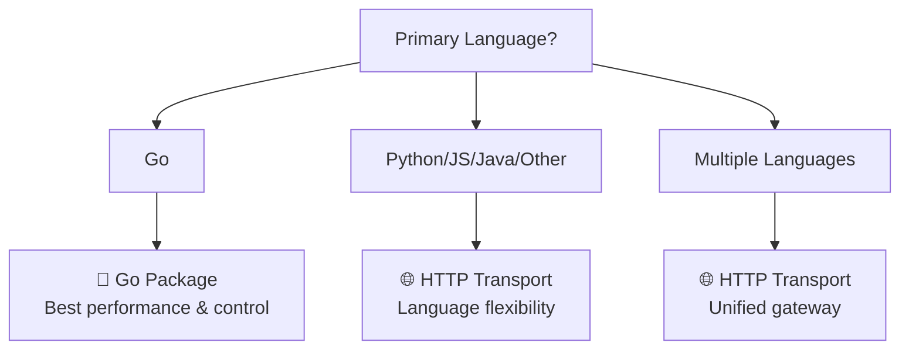
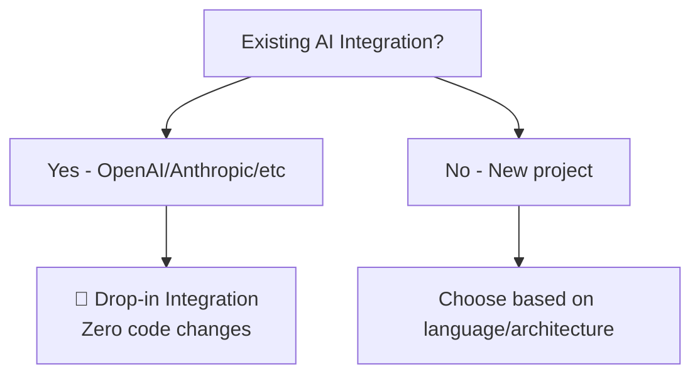
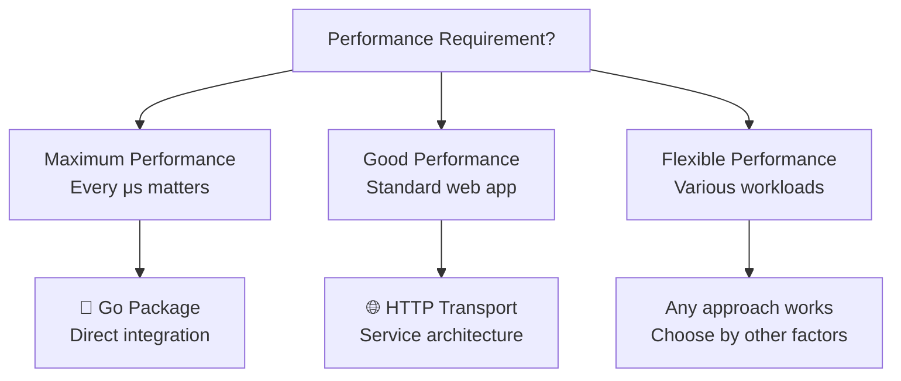
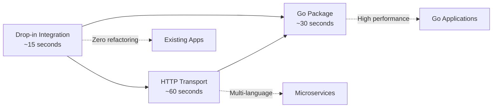

# 📊 Feature Comparison Guide

Not sure which Bifrost approach to use? This guide compares all three usage modes to help you make the right choice.

## 🎯 Quick Decision Matrix

| If You...                         | Recommended Approach                      | Why                              |
| --------------------------------- | ----------------------------------------- | -------------------------------- |
| **Build Go applications**         | [🔧 Go Package](go-package.md)            | Maximum performance & control    |
| **Want language flexibility**     | [🌐 HTTP Transport](http-transport.md)    | Works with any language          |
| **Have existing AI integrations** | [🔄 Drop-in Integration](integrations.md) | Zero code changes needed         |
| **Need maximum performance**      | [🔧 Go Package](go-package.md)            | Direct function calls            |
| **Build microservices**           | [🌐 HTTP Transport](http-transport.md)    | Service-oriented architecture    |
| **Want quick migration**          | [🔄 Drop-in Integration](integrations.md) | Fastest path to Bifrost benefits |

---

## 📋 Detailed Feature Comparison

### 🚀 Getting Started

| Aspect                 | 🔧 Go Package | 🌐 HTTP Transport  | 🔄 Drop-in Integration           |
| ---------------------- | ------------- | ------------------ | -------------------------------- |
| **Setup Time**         | 2 minutes     | 30 seconds         | 1 minute                         |
| **Prerequisites**      | Go 1.23+      | Docker OR Go 1.23+ | Existing AI app + Bifrost server |
| **Initial Complexity** | Medium        | Low                | Very Low                         |
| **Code Changes**       | New Go code   | Language-agnostic  | Zero changes                     |

### ⚡ Performance

| Aspect           | 🔧 Go Package      | 🌐 HTTP Transport        | 🔄 Drop-in Integration   |
| ---------------- | ------------------ | ------------------------ | ------------------------ |
| **Latency**      | Direct calls       | +11-59μs overhead        | +11-59μs overhead        |
| **Throughput**   | Native Go speed    | 5000+ RPS tested         | 5000+ RPS tested         |
| **Memory Usage** | Optimized pools    | Configurable pools       | Configurable pools       |
| **Network Hops** | 1 (to AI provider) | 2 (app→bifrost→provider) | 2 (app→bifrost→provider) |

### 🔧 Development Experience

| Aspect               | 🔧 Go Package          | 🌐 HTTP Transport    | 🔄 Drop-in Integration            |
| -------------------- | ---------------------- | -------------------- | --------------------------------- |
| **Language Support** | Go only                | Any language         | Original language                 |
| **Type Safety**      | ✅ Full Go types       | ⚠️ JSON validation   | ✅ Original SDK types             |
| **IDE Support**      | ✅ Native Go           | ⚠️ API documentation | ✅ Original SDK                   |
| **Debugging**        | ✅ Native Go debugging | ⚠️ HTTP logs         | ✅ Original debugging + HTTP logs |

### 🏗️ Architecture & Deployment

| Aspect                | 🔧 Go Package    | 🌐 HTTP Transport   | 🔄 Drop-in Integration |
| --------------------- | ---------------- | ------------------- | ---------------------- |
| **Deployment Model**  | Embedded library | Standalone service  | Service + client apps  |
| **Scaling**           | Scale with app   | Independent scaling | Independent scaling    |
| **Resource Usage**    | Shared with app  | Dedicated resources | Dedicated resources    |
| **Service Discovery** | Not applicable   | Standard HTTP/DNS   | Standard HTTP/DNS      |

### ⚙️ Configuration

| Aspect                    | 🔧 Go Package       | 🌐 HTTP Transport   | 🔄 Drop-in Integration |
| ------------------------- | ------------------- | ------------------- | ---------------------- |
| **Config Method**         | Go structs          | JSON file           | JSON file              |
| **Hot Reload**            | ❌ Requires restart | ❌ Requires restart | ❌ Requires restart    |
| **Environment Variables** | ✅ Go code          | ✅ JSON + env vars  | ✅ JSON + env vars     |
| **Dynamic Config**        | ✅ Programmatic     | ⚠️ File-based       | ⚠️ File-based          |

---

## 🎨 Use Case Scenarios

### 🔧 Go Package - Best For

<details open>
<summary><strong>🎯 High-Performance Applications</strong></summary>

**Perfect for:**

- Go microservices requiring minimal latency
- High-throughput AI processing pipelines
- Applications where every microsecond matters
- Direct embedding in Go applications

**Example:**

```go
// Real-time AI processing in a Go service
result, err := client.ChatCompletionRequest(ctx, &schemas.BifrostRequest{
    Provider: schemas.OpenAI,
    Model: "gpt-4o-mini",
    Input: input,
})
```

</details>

<details>
<summary><strong>🎯 Custom Business Logic</strong></summary>

**Perfect for:**

- Applications needing custom provider selection logic
- Complex request routing based on business rules
- Deep integration with existing Go systems
- Custom middleware and processing

**Example:**

```go
// Custom provider selection based on user tier
provider := selectProviderByUserTier(user.Tier)
result, err := client.ChatCompletionRequest(ctx, &schemas.BifrostRequest{
    Provider: provider,
    Model: getModelForTier(user.Tier),
    Input: input,
})
```

</details>

### 🌐 HTTP Transport - Best For

<details>
<summary><strong>🎯 Multi-Language Environments</strong></summary>

**Perfect for:**

- Teams using Python, JavaScript, Java, etc.
- Microservices in different languages
- API-first architectures
- Language-agnostic AI gateway

**Example:**

```python
# Python service calling Bifrost
response = requests.post('http://bifrost:8080/v1/chat/completions',
    json={"provider": "openai", "model": "gpt-4o-mini", "messages": messages}
)
```

```javascript
// Node.js service calling Bifrost
const response = await fetch("http://bifrost:8080/v1/chat/completions", {
  method: "POST",
  body: JSON.stringify({ provider: "openai", model: "gpt-4o-mini", messages }),
});
```

</details>

<details>
<summary><strong>🎯 Centralized AI Gateway</strong></summary>

**Perfect for:**

- Organizations wanting centralized AI management
- Multi-tenant applications
- Shared AI infrastructure across teams
- Centralized monitoring and governance

**Example:**

```yaml
# Kubernetes deployment
apiVersion: apps/v1
kind: Deployment
metadata:
  name: bifrost-gateway
spec:
  replicas: 3
  template:
    spec:
      containers:
        - name: bifrost
          image: maximhq/bifrost:latest
```

</details>

### 🔄 Drop-in Integration - Best For

<details>
<summary><strong>🎯 Existing Applications</strong></summary>

**Perfect for:**

- Applications already using OpenAI/Anthropic APIs
- Teams wanting immediate Bifrost benefits
- Risk-averse migration strategies
- Legacy system integration

**Example:**

```python
# Before
client = OpenAI(api_key="sk-...")

# After - just change base_url
client = OpenAI(api_key="dummy", base_url="http://bifrost:8080/openai")
# All existing code works unchanged!
```

</details>

<details>
<summary><strong>🎯 Zero-Downtime Migration</strong></summary>

**Perfect for:**

- Production systems requiring high availability
- Gradual rollout strategies
- A/B testing with different providers
- Risk mitigation during migration

**Migration Strategy:**

1. Deploy Bifrost alongside existing system
2. Route percentage of traffic to Bifrost
3. Gradually increase traffic percentage
4. Complete migration when confident

</details>

---

## 🤔 Decision Framework

### Step 1: What's Your Primary Language?



### Step 2: Do You Have Existing AI Integration?



### Step 3: What's Your Performance Requirement?



---

## 🔄 Migration Paths

### From Go Package → HTTP Transport

**When:** You want to support multiple languages or centralize AI management

```go
// Before: Direct Go package usage
result, err := client.ChatCompletionRequest(ctx, request)

// After: HTTP API calls
response, err := http.Post("http://bifrost:8080/v1/chat/completions", "application/json", body)
```

### From HTTP Transport → Go Package

**When:** You want maximum performance in a Go-only environment

```bash
# Before: HTTP service deployment
docker run maximhq/bifrost

# After: Go package integration
go get github.com/maximhq/bifrost/core
```

### From Drop-in → Native Bifrost API

**When:** You want access to advanced Bifrost features

```python
# Before: Drop-in replacement
client = OpenAI(base_url="http://bifrost:8080/openai")

# After: Native Bifrost API with fallbacks
requests.post('http://bifrost:8080/v1/chat/completions', json={
    "provider": "openai",
    "model": "gpt-4o-mini",
    "fallbacks": [{"provider": "anthropic", "model": "claude-3-sonnet"}]
})
```

---

## 📊 Feature Support Matrix

| Feature                | 🔧 Go Package  | 🌐 HTTP Transport | 🔄 Drop-in Integration |
| ---------------------- | -------------- | ----------------- | ---------------------- |
| **Multiple Providers** | ✅ Full        | ✅ Full           | ✅ Per endpoint        |
| **Fallback Systems**   | ✅ Full        | ✅ Full           | ⚠️ Via native API      |
| **Key Rotation**       | ✅ Full        | ✅ Full           | ✅ Automatic           |
| **MCP Tools**          | ✅ Full        | ✅ Full           | ⚠️ Via native API      |
| **Custom Plugins**     | ✅ Full        | ✅ Full           | ✅ Automatic           |
| **Observability**      | ✅ Full        | ✅ Full           | ✅ Automatic           |
| **Rate Limiting**      | ✅ Full        | ✅ Full           | ✅ Automatic           |
| **Caching**            | ✅ Via plugins | ✅ Via plugins    | ✅ Via plugins         |
| **Custom Headers**     | ✅ Full        | ✅ Full           | ⚠️ Limited             |
| **Streaming**          | ✅ Full        | ✅ Full           | ✅ Native support      |

---

## 💡 Recommendations by Team Size

### 👤 Individual Developer / Small Team (1-5 people)

**Recommended:** 🔄 **Drop-in Integration**

- Fastest time to value
- Minimal learning curve
- Easy to experiment with

### 👥 Medium Team (5-20 people)

**Recommended:** 🌐 **HTTP Transport**

- Language flexibility for growing teams
- Clear service boundaries
- Easy to scale and manage

### 🏢 Large Organization (20+ people)

**Recommended:** 🌐 **HTTP Transport** + 🔄 **Drop-in Integration**

- HTTP Transport for new projects
- Drop-in for migrating existing systems
- Centralized governance and monitoring

---

## 🎯 Common Questions

<details>
<summary><strong>Can I use multiple approaches in the same organization?</strong></summary>

**Yes!** Many organizations use:

- **HTTP Transport** for their main AI gateway
- **Drop-in Integration** for migrating legacy systems
- **Go Package** for performance-critical Go services

This hybrid approach provides maximum flexibility.

</details>

<details>
<summary><strong>Can I switch between approaches later?</strong></summary>

**Absolutely!** Bifrost is designed for easy migration:

- Same configuration format across approaches
- Same feature set (with minor differences)
- Clear migration paths documented

</details>

<details>
<summary><strong>Which approach is most popular?</strong></summary>

**Usage patterns:**

1. **HTTP Transport** - Most popular for new deployments
2. **Drop-in Integration** - Most popular for migrations
3. **Go Package** - Popular for Go-native high-performance use cases

</details>

---

## 🚀 Next Steps

Ready to get started? Choose your path:

| Approach                   | Quick Start                          | Documentation                            |
| -------------------------- | ------------------------------------ | ---------------------------------------- |
| **🔧 Go Package**          | [2-minute setup](go-package.md)      | [Full Go docs](../usage/go-package/)     |
| **🌐 HTTP Transport**      | [30-second setup](http-transport.md) | [Full HTTP docs](../usage/http-api/)     |
| **🔄 Drop-in Integration** | [1-minute setup](integrations.md)    | [Migration guides](../guides/migration/) |

**Still unsure?** Start with [🔄 Drop-in Integration](integrations.md) - it's the fastest way to experience Bifrost benefits with zero risk.

---

## ❓ Need Help Deciding?

- **[❓ FAQ](../guides/faq.md)** - Common questions about choosing approaches
- **[💬 GitHub Discussions](https://github.com/maximhq/bifrost/discussions)** - Ask the community
- **[🔧 Architecture Guide](../architecture/system-overview.md)** - Deep dive into how Bifrost works

Built with ❤️ by [Maxim](https://github.com/maximhq)

# 🆚 Feature Comparison Matrix

Complete comparison of Bifrost's integration methods to help you choose the right approach for your needs.

## 📊 Quick Comparison

| Feature                |  🔧 Go Package  | 🌐 HTTP Transport | 🔄 Drop-in Integration |
| ---------------------- | :-------------: | :---------------: | :--------------------: |
| **Setup Time**         |   ~30 seconds   |    ~60 seconds    |      ~15 seconds       |
| **Code Changes**       |    New code     |   Any language    |      Zero changes      |
| **Language Support**   |     Go only     |   Any language    |      Any language      |
| **Performance**        |     Highest     |       High        |          High          |
| **Type Safety**        | ✅ Compile-time |    ❌ Runtime     |       ❌ Runtime       |
| **Direct Integration** |     ✅ Yes      |    ❌ Via HTTP    |      ❌ Via HTTP       |

---

## 🎯 Use Case Recommendations

### 🔧 **Go Package** - Choose When:

| Scenario                            | Why Go Package is Best                                   |
| ----------------------------------- | -------------------------------------------------------- |
| **Building new Go application**     | Direct integration, type safety, compile-time validation |
| **High-performance requirements**   | No HTTP overhead, direct memory access                   |
| **Complex business logic**          | Custom account interfaces, advanced configurations       |
| **Embedded applications**           | Single binary deployment, no external dependencies       |
| **Custom provider implementations** | Extend Bifrost with your own providers                   |

### 🌐 **HTTP Transport** - Choose When:

| Scenario                            | Why HTTP Transport is Best               |
| ----------------------------------- | ---------------------------------------- |
| **Multi-language environment**      | Python, Node.js, PHP, Ruby, etc. support |
| **Microservices architecture**      | Centralized AI gateway for all services  |
| **Team has various tech stacks**    | Standardized REST API interface          |
| **Scaling AI requests separately**  | Independent scaling of AI logic          |
| **Container/Kubernetes deployment** | Standard HTTP service patterns           |

### 🔄 **Drop-in Integration** - Choose When:

| Scenario                           | Why Drop-in is Best                            |
| ---------------------------------- | ---------------------------------------------- |
| **Existing OpenAI/Anthropic code** | Zero code changes, instant benefits            |
| **Testing Bifrost**                | No refactoring needed for evaluation           |
| **Legacy application migration**   | Gradual migration with immediate benefits      |
| **Third-party SDK compatibility**  | Works with existing LangChain, Vercel AI, etc. |
| **Proof of concept**               | Fastest way to demonstrate value               |

---

## 🚀 Feature Matrix

### Core Features

| Feature                   |  🔧 Go Package   | 🌐 HTTP Transport |     🔄 Drop-in     |
| ------------------------- | :--------------: | :---------------: | :----------------: |
| **Multiple AI Providers** |  ✅ 8 providers  |  ✅ 8 providers   |   ✅ 8 providers   |
| **Automatic Fallbacks**   | ✅ Full control  |   ✅ Via config   |    ✅ Automatic    |
| **Load Balancing**        | ✅ Weighted keys | ✅ Weighted keys  |  ✅ Weighted keys  |
| **Request Retry Logic**   | ✅ Configurable  |  ✅ Configurable  |    ✅ Built-in     |
| **Error Handling**        |   ✅ Type-safe   |  ✅ HTTP status   | ✅ Provider format |

### Performance & Scaling

| Feature                    |    🔧 Go Package     |  🌐 HTTP Transport   |      🔄 Drop-in      |
| -------------------------- | :------------------: | :------------------: | :------------------: |
| **Request Latency**        | **11-59μs overhead** |   ~1-2ms overhead    |   ~1-2ms overhead    |
| **Memory Usage**           |      **Lowest**      |         Low          |         Low          |
| **Concurrent Requests**    |    **Native Go**     | HTTP connection pool | HTTP connection pool |
| **Worker Pool Management** |  ✅ Direct control   |   ✅ Configurable    |     ✅ Automatic     |
| **Memory Optimization**    |   ✅ Custom pools    |     ✅ Built-in      |     ✅ Built-in      |

### Configuration & Customization

| Feature                    |      🔧 Go Package       | 🌐 HTTP Transport |    🔄 Drop-in     |
| -------------------------- | :----------------------: | :---------------: | :---------------: |
| **Account Interface**      | ✅ Custom implementation |  ✅ JSON config   |  ✅ JSON config   |
| **Provider Configuration** |   ✅ Type-safe structs   |  ✅ JSON config   |  ✅ JSON config   |
| **Environment Variables**  |     ✅ Full control      | ✅ env.\* support | ✅ env.\* support |
| **Network Configuration**  |     ✅ Per-provider      |  ✅ Per-provider  |  ✅ Per-provider  |
| **Proxy Support**          |      ✅ HTTP/SOCKS5      |  ✅ HTTP/SOCKS5   |  ✅ HTTP/SOCKS5   |

### Development Experience

| Feature            |    🔧 Go Package    | 🌐 HTTP Transport |     🔄 Drop-in     |
| ------------------ | :-----------------: | :---------------: | :----------------: |
| **IDE Support**    | ✅ Full Go tooling  |   ✅ HTTP tools   |  ✅ Existing SDK   |
| **Debugging**      | ✅ Native debugging |  ✅ HTTP logging  |  ✅ SDK debugging  |
| **Error Messages** | ✅ Type-safe errors |  ✅ HTTP errors   | ✅ Provider errors |
| **Documentation**  |      ✅ GoDoc       |  ✅ OpenAPI spec  |  ✅ Provider docs  |
| **Testing**        | ✅ Unit/integration |  ✅ HTTP testing  | ✅ Existing tests  |

### Advanced Features

| Feature                  |     🔧 Go Package      |  🌐 HTTP Transport   |      🔄 Drop-in       |
| ------------------------ | :--------------------: | :------------------: | :-------------------: |
| **Plugin System**        |   ✅ Native plugins    |    ✅ Via config     |      ❌ Limited       |
| **MCP Tool Integration** | ✅ Direct integration  |  ✅ HTTP endpoints   |   ❌ Not available    |
| **Custom Providers**     | ✅ Implement interface |   ❌ Not supported   |   ❌ Not supported    |
| **Streaming Support**    |   ✅ Native streams    |  ✅ HTTP streaming   | ✅ Provider streaming |
| **Batch Processing**     |   ✅ Direct control    | ✅ Multiple requests | ✅ Provider batching  |

### Monitoring & Observability

| Feature                   |   🔧 Go Package    |  🌐 HTTP Transport  |     🔄 Drop-in      |
| ------------------------- | :----------------: | :-----------------: | :-----------------: |
| **Prometheus Metrics**    | ✅ Custom metrics  | ✅ Built-in metrics | ✅ Built-in metrics |
| **Request Tracing**       | ✅ Context tracing |   ✅ HTTP tracing   | ✅ Provider tracing |
| **Logging Integration**   |  ✅ Custom logger  | ✅ Structured logs  |  ✅ Existing logs   |
| **Health Checks**         |  ✅ Custom health  | ✅ /health endpoint | ✅ Provider health  |
| **Performance Profiling** |  ✅ pprof support  |   ✅ /debug/pprof   |     ❌ Limited      |

---

## 🔄 Migration Path

### Development Evolution



### Typical Journey

1. **🔄 Start with Drop-in** - Test Bifrost with zero changes
2. **🌐 Move to HTTP Transport** - Add centralized configuration
3. **🔧 Upgrade to Go Package** - Maximize performance and control

---

## 📈 Performance Comparison

### Latency Overhead

| Method                | Overhead    | Use Case                     |
| --------------------- | ----------- | ---------------------------- |
| **🔧 Go Package**     | **11-59μs** | High-frequency, low-latency  |
| **🌐 HTTP Transport** | ~1-2ms      | Standard web applications    |
| **🔄 Drop-in**        | ~1-2ms      | Existing application testing |

### Throughput (Requests/Second)

| Method                | Single Instance | With Load Balancing |
| --------------------- | --------------- | ------------------- |
| **🔧 Go Package**     | **5,000+ RPS**  | 15,000+ RPS         |
| **🌐 HTTP Transport** | **3,000+ RPS**  | 10,000+ RPS         |
| **🔄 Drop-in**        | **3,000+ RPS**  | 10,000+ RPS         |

---

## 🛠️ Setup Complexity

### Go Package Setup

```go
// ✅ Pros: Type-safe, compile-time validation, direct integration
// ❌ Cons: Go-only, requires account interface implementation

type MyAccount struct{}
func (a *MyAccount) GetConfiguredProviders() ([]schemas.ModelProvider, error) { ... }
func (a *MyAccount) GetKeysForProvider(provider schemas.ModelProvider) ([]schemas.Key, error) { ... }
func (a *MyAccount) GetConfigForProvider(provider schemas.ModelProvider) (*schemas.ProviderConfig, error) { ... }

client, err := bifrost.Init(schemas.BifrostConfig{Account: &MyAccount{}})
```

### HTTP Transport Setup

```json
// ✅ Pros: Any language, centralized config, easy deployment
// ❌ Cons: HTTP overhead, runtime configuration errors

{
  "providers": {
    "openai": {
      "keys": [
        {
          "value": "env.OPENAI_API_KEY",
          "models": ["gpt-4o-mini"],
          "weight": 1.0
        }
      ]
    }
  }
}
```

### Drop-in Integration Setup

```python
# ✅ Pros: Zero code changes, instant benefits, existing SDKs
# ❌ Cons: Limited customization, dependency on provider APIs

# Before
client = OpenAI(api_key="key")

# After - only change base_url
client = OpenAI(api_key="key", base_url="http://localhost:8080/openai/v1")
```

---

## 🎯 Decision Matrix

### Quick Decision Tree

1. **Are you building a new Go application?**

   - ✅ Yes → **Go Package**
   - ❌ No → Continue

2. **Do you have existing OpenAI/Anthropic code?**

   - ✅ Yes → **Drop-in Integration**
   - ❌ No → Continue

3. **Do you need multi-language support?**
   - ✅ Yes → **HTTP Transport**
   - ❌ No → **Go Package**

### By Team Size

| Team Size           | Recommendation       | Reason                                  |
| ------------------- | -------------------- | --------------------------------------- |
| **1-5 developers**  | 🔧 Go Package        | Direct integration, full control        |
| **5-20 developers** | 🌐 HTTP Transport    | Centralized gateway, multiple languages |
| **20+ developers**  | 🔄 Drop-in → 🌐 HTTP | Gradual migration, minimal disruption   |

---

## 📚 Next Steps

Choose your method and get started:

| Method                     | Next Step                              | Documentation                                           |
| -------------------------- | -------------------------------------- | ------------------------------------------------------- |
| **🔧 Go Package**          | [30-Second Setup](go-package.md)       | [Go Package Guide](../usage/go-package/README.md)       |
| **🌐 HTTP Transport**      | [60-Second Setup](http-transport.md)   | [HTTP API Reference](../usage/http-api/README.md)       |
| **🔄 Drop-in Integration** | [15-Second Migration](integrations.md) | [Integration Guide](../features/integrations/README.md) |

---

**🎯 Still unsure? Start with [Drop-in Integration](integrations.md) to test Bifrost risk-free!**
