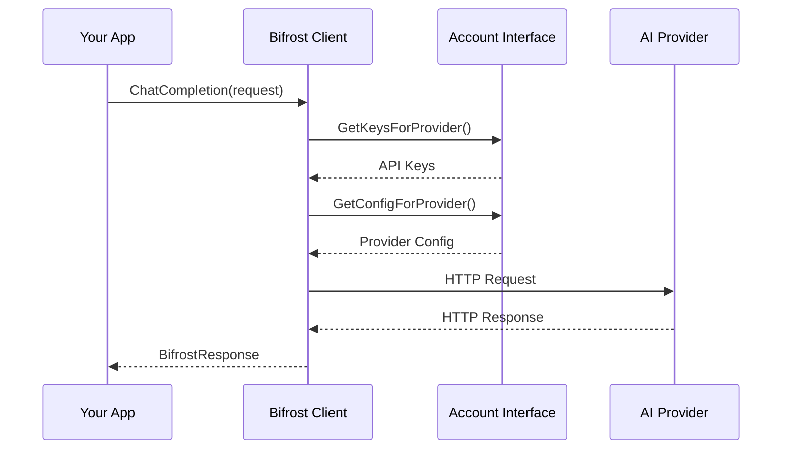

# 🔧 Go Package API Reference

Complete Go package API documentation with type-safe interfaces, advanced configuration, and comprehensive examples.

## 📋 Quick Navigation

| Component             | Description                          | Documentation                              |
| --------------------- | ------------------------------------ | ------------------------------------------ |
| **🏠 Bifrost Client** | Main client initialization & methods | [📖 Client Reference →](bifrost-client.md) |
| **📋 Schemas**        | Types, interfaces & data structures  | [📖 Schema Reference →](schemas.md)        |
| **🔗 Providers**      | Provider-specific configurations     | [📖 Provider Reference →](providers.md)    |
| **💡 Examples**       | Complete usage examples              | [📖 Examples →](examples.md)               |

---

## ⚡ Quick Start

### 1. Installation

```bash
go get github.com/maximhq/bifrost/core
```

### 2. Basic Setup

```go
package main

import (
    "context"
    "fmt"
    "os"

    "github.com/maximhq/bifrost/core"
    "github.com/maximhq/bifrost/core/schemas"
)

// Account implementation - see canonical version
// 📖 [Complete Account Implementation →](../examples.md#basic-account-implementation)

func main() {
    // Initialize Bifrost
    client, err := bifrost.Init(schemas.BifrostConfig{
        Account: &MyAccount{},
        Logger:  bifrost.NewDefaultLogger(schemas.LogLevelInfo),
    })
    if err != nil {
        panic(err)
    }
    defer client.Cleanup()

    // Make a chat completion request
    response, err := client.ChatCompletionRequest(context.Background(), &schemas.BifrostRequest{
        Provider: schemas.OpenAI,
        Model:    "gpt-4o-mini",
        Input: schemas.RequestInput{
            ChatCompletionInput: &[]schemas.BifrostMessage{
                {
                    Role:    schemas.ModelChatMessageRoleUser,
                    Content: schemas.MessageContent{ContentStr: &[]string{"Hello, Bifrost!"}[0]},
                },
            },
        },
    })

    if err != nil {
        panic(err)
    }

    fmt.Println(response.Choices[0].Message.Content)
}
```

---

## 🏗️ Core Architecture

### Client Lifecycle

```go
// Initialize client with configuration
client, err := bifrost.Init(schemas.BifrostConfig{
    Account:            account,           // Required: Provider configurations
    Plugins:            []schemas.Plugin{}, // Optional: Middleware plugins
    Logger:             logger,            // Optional: Custom logger
    InitialPoolSize:    100,              // Optional: Memory pool size
    DropExcessRequests: false,            // Optional: Request overflow behavior
    MCPConfig:          mcpConfig,        // Optional: MCP tool integration
})

// Use client for requests
response, err := client.ChatCompletion(ctx, request)

// Cleanup resources (important!)
defer client.Cleanup()
```

### Request/Response Flow



---

## 🎯 Key Interfaces

### Required: Account Interface

Every Bifrost client must implement the `Account` interface:

```go
type Account interface {
    GetConfiguredProviders() ([]ModelProvider, error)
    GetKeysForProvider(ModelProvider) ([]Key, error)
    GetConfigForProvider(ModelProvider) (*ProviderConfig, error)
}
```

**[📖 Complete Account Interface Guide →](schemas.md#account-interface)**

### Optional: Plugin Interface

Extend Bifrost functionality with custom plugins:

```go
type Plugin interface {
    Name() string
    PreHook(ctx context.Context, request *BifrostRequest) (*BifrostRequest, error)
    PostHook(ctx context.Context, response *BifrostResponse) (*BifrostResponse, error)
}
```

**[📖 Complete Plugin System Guide →](../features/plugins.md)**

### Optional: Logger Interface

Integrate with your existing logging system:

```go
type Logger interface {
    Debug(msg string, fields ...LogField)
    Info(msg string, fields ...LogField)
    Warn(msg string, fields ...LogField)
    Error(msg string, fields ...LogField)
}
```

**[📖 Complete Logging Guide →](../features/logging.md)**

---

## 📊 Advanced Features

### Memory Management

Optimize performance with configurable memory pools:

```go
client, err := bifrost.Init(schemas.BifrostConfig{
    Account:         account,
    InitialPoolSize: 500,  // Larger pool for high-throughput apps
})
```

**[📖 Memory Management Guide →](../features/memory-management.md)**

### Fallback Configuration

Add automatic failover across providers:

```go
response, err := client.ChatCompletion(ctx, schemas.BifrostRequest{
    Provider: schemas.OpenAI,
    Model:    "gpt-4o",
    Input:    input,
    Fallbacks: []schemas.Fallback{
        {Provider: schemas.Anthropic, Model: "claude-3-sonnet-20240229"},
        {Provider: schemas.Bedrock, Model: "anthropic.claude-3-sonnet-20240229-v1:0"},
    },
})
```

**[📖 Fallback Systems Guide →](../features/fallbacks.md)**

### MCP Tool Integration

Enable external tool calling with Model Context Protocol:

```go
// Configure MCP in BifrostConfig
mcpConfig := &schemas.MCPConfig{
    ClientConfigs: []schemas.MCPClientConfig{
        {
            Name:           "filesystem",
            ConnectionType: schemas.MCPConnectionTypeSTDIO,
            StdioConfig: &schemas.MCPStdioConfig{
                Command: "npx",
                Args:    []string{"@modelcontextprotocol/server-filesystem", "/tmp"},
            },
        },
    },
}

client, err := bifrost.Init(schemas.BifrostConfig{
    Account:   account,
    MCPConfig: mcpConfig,
})
```

**[📖 MCP Integration Guide →](../features/mcp-integration.md)**

---

## 🔍 Error Handling

### BifrostError Structure

All Bifrost errors implement the `BifrostError` type:

```go
type BifrostError struct {
    EventID        *string    `json:"event_id,omitempty"`
    Type           *string    `json:"type,omitempty"`
    IsBifrostError bool       `json:"is_bifrost_error"`
    StatusCode     *int       `json:"status_code,omitempty"`
    Error          ErrorField `json:"error"`
}
```

### Error Handling Patterns

```go
response, err := client.ChatCompletion(ctx, request)
if err != nil {
    var bifrostErr *schemas.BifrostError
    if errors.As(err, &bifrostErr) {
        // Handle Bifrost-specific errors
        switch *bifrostErr.Error.Type {
        case "rate_limit_error":
            // Handle rate limiting
        case "authentication_error":
            // Handle auth issues
        case "provider_error":
            // Handle provider failures
        default:
            // Handle other errors
        }
    } else {
        // Handle system errors
    }
}
```

**[📖 Complete Error Reference →](../errors.md)**

---

## 📚 Next Steps

### Learning Path

1. **[🚀 Quick Start](../../quick-start/go-package.md)** - Get up and running in 2 minutes
2. **[📋 Schemas Reference](schemas.md)** - Understand all data structures
3. **[🏠 Client Methods](bifrost-client.md)** - Learn all available methods
4. **[💡 Complete Examples](examples.md)** - See real-world usage patterns

### Advanced Topics

- **[🔗 Provider Configurations](providers.md)** - Provider-specific settings
- **[🔌 Plugin Development](../features/plugins.md)** - Build custom middleware
- **[⚡ Performance Tuning](../features/memory-management.md)** - Optimize for scale
- **[📊 Observability](../features/observability.md)** - Monitor your usage

---

**Need help?** Check our [❓ FAQ](../../guides/faq.md) or [🔧 Troubleshooting Guide](../../guides/troubleshooting.md).
