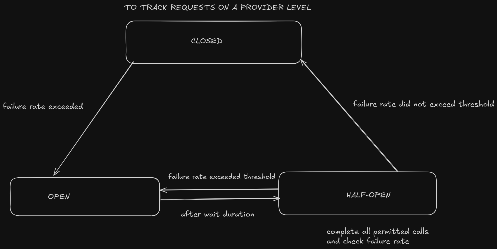

# Bifrost Circuit Breaker Plugin

The Circuit Breaker plugin for Bifrost provides automatic failure detection and recovery for AI provider requests. It monitors request failures and slow calls, automatically opening the circuit when thresholds are exceeded to prevent cascading failures.

## Quick Start

### Download the Plugin

   ```bash
   go get github.com/maximhq/bifrost/plugins/circuitbreaker
   ```

### Basic Usage

```go
package main

import (
    "context"
    bifrost "github.com/maximhq/bifrost/core"
    "github.com/maximhq/bifrost/core/schemas"
    circuitbreaker "github.com/maximhq/bifrost/plugins/circuitbreaker"
)

func main() {
    // Create plugin with default configuration
    circuitbreakerPlugin, err := circuitbreaker.NewCircuitBreakerPlugin(circuitbreaker.CircuitBreakerConfig{
        FailureRateThreshold: 0.5, // 50% failure rate threshold
        SlowCallRateThreshold: 0.5, // 50% slow call rate threshold
        SlowCallDurationThreshold: 5 * time.Second,
        MinimumNumberOfCalls: 10,
        SlidingWindowType: circuitbreaker.CountBased, // Track last N calls
        SlidingWindowSize: 100, // Track last 100 calls
        PermittedNumberOfCallsInHalfOpenState: 5,
        MaxWaitDurationInHalfOpenState: 60 * time.Second,
    })
    if err != nil {
        panic(err)
    }

    // Initialize Bifrost with the plugin
    client, err := bifrost.Init(schemas.BifrostConfig{
        Account: &yourAccount,
        Plugins: []schemas.Plugin{circuitbreakerPlugin},
    })
    if err != nil {
        panic(err)
    }
    defer client.Cleanup()

    // Circuit breaker will automatically protect your requests
    response, err := client.ChatCompletionRequest(context.Background(), &schemas.BifrostRequest{
        Provider: schemas.OpenAI,
        Model:    "gpt-4",
        Input: schemas.RequestInput{
            ChatCompletionInput: &[]schemas.BifrostMessage{
                {
                    Role: schemas.ModelChatMessageRoleUser,
                    Content: schemas.MessageContent{
                        ContentStr: bifrost.Ptr("Hello!"),
                    },
                },
            },
        },
    })
}
```

### State Diagram of Circuit Breaker


### Default Configuration

```go
// Use default configuration (recommended for most cases)
plugin := circuitbreaker.NewDefaultCircuitBreakerPlugin()
```

## Configuration

### CircuitBreakerConfig

| Field | Type | Default | Description |
|-------|------|---------|-------------|
| `FailureRateThreshold` | `float64` | `0.5` | Failure rate threshold (0.0 to 1.0) |
| `SlowCallRateThreshold` | `float64` | `0.5` | Slow call rate threshold (0.0 to 1.0) |
| `SlowCallDurationThreshold` | `time.Duration` | `5s` | Duration threshold for slow calls |
| `MinimumNumberOfCalls` | `int` | `10` | Minimum calls before evaluation |
| `SlidingWindowType` | `string` | `"count-based"` | `"count-based"` or `"time-based"` |
| `SlidingWindowSize` | `int` | `100` | Size of sliding window (calls for count-based, seconds for time-based) |
| `PermittedNumberOfCallsInHalfOpenState` | `int` | `5` | Calls allowed in half-open state |
| `MaxWaitDurationInHalfOpenState` | `time.Duration` | `60s` | Wait time before half-open transition |

### Sliding Window Types

The circuit breaker supports two types of sliding windows for collecting metrics:

#### Count-Based Sliding Window
- **Type**: `"count-based"`
- **Size**: Number of most recent calls to track
- **Behavior**: Maintains a fixed-size circular buffer of the last N calls
- **Use Case**: When you want to evaluate based on a specific number of recent requests
- **Example**: Track the last 100 calls to evaluate failure rates

#### Time-Based Sliding Window
- **Type**: `"time-based"`
- **Size**: Duration in seconds to look back
- **Behavior**: Maintains all calls within the specified time window
- **Use Case**: When you want to evaluate based on a time period
- **Example**: Track all calls in the last 5 minutes to evaluate failure rates

### Configuration Examples

#### Count-Based Sliding Window (Default)

```go
config := circuitbreaker.CircuitBreakerConfig{
    FailureRateThreshold: 0.3, // 30% failure rate threshold
    SlowCallRateThreshold: 0.4, // 40% slow call rate threshold
    SlowCallDurationThreshold: 10 * time.Second,
    MinimumNumberOfCalls: 20,
    SlidingWindowType: circuitbreaker.CountBased, // Track last N calls
    SlidingWindowSize: 200, // Track last 200 calls
    PermittedNumberOfCallsInHalfOpenState: 3,
    MaxWaitDurationInHalfOpenState: 30 * time.Second,
}
```

#### Time-Based Sliding Window

```go
config := circuitbreaker.CircuitBreakerConfig{
    FailureRateThreshold: 0.3, // 30% failure rate threshold
    SlowCallRateThreshold: 0.4, // 40% slow call rate threshold
    SlowCallDurationThreshold: 10 * time.Second,
    MinimumNumberOfCalls: 20,
    SlidingWindowType: circuitbreaker.TimeBased, // Track calls in time window
    SlidingWindowSize: 300, // Track calls in last 300 seconds (5 minutes)
    PermittedNumberOfCallsInHalfOpenState: 3,
    MaxWaitDurationInHalfOpenState: 30 * time.Second,
}
```

## Circuit States

### CLOSED (Normal Operation)
- Requests are sent to providers normally
- Circuit breaker monitors failures and slow calls
- Metrics are collected in sliding window

### OPEN (Failure Protection)
- All requests are immediately rejected
- No provider calls are made
- Prevents cascading failures
- Automatically transitions to HALF_OPEN after wait duration

### HALF_OPEN (Recovery Testing)
- Limited number of requests are allowed through
- Success/failure determines next state
- Success → CLOSED (recovery complete)
- Failure → OPEN (still failing)

## Monitoring

### Get Circuit State

```go
state, exists := plugin.GetState(schemas.OpenAI)
if exists {
    switch state {
    case circuitbreaker.StateClosed:
        fmt.Println("Circuit is CLOSED - normal operation")
    case circuitbreaker.StateOpen:
        fmt.Println("Circuit is OPEN - requests blocked")
    case circuitbreaker.StateHalfOpen:
        fmt.Println("Circuit is HALF_OPEN - testing recovery")
    }
}
```

### Get Metrics

```go
metrics, err := plugin.GetMetrics(schemas.OpenAI)
if err == nil {
    fmt.Printf("Total Calls: %d\n", metrics.TotalCalls)
    fmt.Printf("Failed Calls: %d\n", metrics.FailedCalls)
    fmt.Printf("Failure Rate: %.2f%%\n", metrics.FailureRate*100)
    fmt.Printf("Slow Call Rate: %.2f%%\n", metrics.SlowCallRate*100)
}
```


## Performance

The Circuit Breaker plugin is optimized for high-performance scenarios:

- **Atomic Operations**: Uses atomic counters for thread-safe statistics
- **Lock-Free Reads**: Read operations don't block other operations
- **Memory Efficient**: Pre-allocated data structures with minimal allocations

## Best Practices

1. **Monitor Metrics**: Regularly check circuit states and failure rates
2. **Adjust Thresholds**: Lower thresholds for critical services, higher for non-critical
3. **Test Recovery**: Verify half-open state works correctly in your environment
4. **Use Fallbacks**: Combine with Bifrost's fallback providers for maximum resilience

**Need help?** Check the [Bifrost documentation](../../docs/plugins.md) or open an issue on GitHub.
