# Bifrost MCP Plugin

The **Bifrost MCP (Model Context Protocol) Plugin** provides seamless integration between Bifrost and MCP servers, enabling dynamic tool discovery, registration, and execution from both local and external MCP sources.

## Table of Contents

- [Overview](#overview)
- [Features](#features)
- [Quick Start](#quick-start)
- [Configuration](#configuration)
- [Usage Examples](#usage-examples)
- [Architecture](#architecture)
- [API Reference](#api-reference)
- [Advanced Features](#advanced-features)
- [Troubleshooting](#troubleshooting)
- [Contributing](#contributing)

## Overview

The MCP Plugin acts as a bridge between Bifrost and the Model Context Protocol ecosystem, allowing you to:

- **Host Local Tools**: Register Go functions as MCP tools directly in Bifrost
- **Connect to External MCP Servers**: Integrate with existing MCP servers via HTTP or STDIO
- **Intelligent Tool Execution**: Support for both automatic execution and user approval workflows
- **Agentic Mode**: Enable LLM-driven tool result synthesis for natural language responses
- **Dynamic Tool Discovery**: Automatically discover and register tools from connected MCP servers

## Features

### 🔧 **Tool Management**

- **Local Tool Hosting**: Register typed Go functions as MCP tools
- **External Tool Integration**: Connect to HTTP or STDIO-based MCP servers
- **Dynamic Discovery**: Automatically discover tools from external servers
- **Tool Filtering**: Include/exclude specific tools or clients per request

### 🔒 **Security & Control**

- **Execution Policies**: Configure per-tool approval requirements
- **Client Filtering**: Control which MCP clients are active per request
- **Tool Skipping**: Exclude specific tools from specific clients
- **Safe Defaults**: Require approval by default for external tools

### 🤖 **Agentic Mode**

- **Result Synthesis**: Send tool results back to LLM for natural language responses
- **Conversation Flow**: Maintain context across tool executions
- **Fallback Handling**: Gracefully degrade when agentic mode fails

### 🔌 **Connection Types**

- **HTTP**: Connect to web-based MCP servers
- **STDIO**: Launch and communicate with command-line MCP tools
- **Process Management**: Automatic cleanup of STDIO processes

## Quick Start

### 1. Basic Setup

```go
package main

import (
    "github.com/maximhq/bifrost/core"
    "github.com/maximhq/bifrost/core/schemas"
    "github.com/maximhq/bifrost/plugins/mcp"
)

func main() {
    // Create plugin with default configuration
    plugin, err := mcp.NewMCPPlugin(mcp.MCPPluginConfig{
        ServerPort:  ":8181",
        AgenticMode: false,
    }, nil)
    if err != nil {
        panic(err)
    }

    // Create Bifrost instance
    bifrost := bifrost.NewBifrost(bifrost.BifrostConfig{
        Plugins: []schemas.Plugin{plugin},
    })

    // Register the plugin with Bifrost for agentic mode (optional)
    plugin.SetBifrostClient(bifrost)
}
```

### 2. Register a Simple Tool

```go
// Define tool arguments structure
type EchoArgs struct {
    Message string `json:"message"`
}

// Create tool schema
toolSchema := schemas.Tool{
    Type: "function",
    Function: schemas.Function{
        Name:        "echo",
        Description: "Echo a message back to the user",
        Parameters: schemas.FunctionParameters{
            Type: "object",
            Properties: map[string]interface{}{
                "message": map[string]interface{}{
                    "type":        "string",
                    "description": "The message to echo back",
                },
            },
            Required: []string{"message"},
        },
    },
}

// Register the tool
err := mcp.RegisterTool(plugin, "echo", "Echo a message",
    func(args EchoArgs) (string, error) {
        return fmt.Sprintf("Echo: %s", args.Message), nil
    }, toolSchema, mcp.ToolExecutionPolicyAutoExecute)
```

### 3. Connect to External MCP Server

```go
// Connect to HTTP-based MCP server
err := plugin.ConnectToExternalMCP(mcp.ExternalMCPConfig{
    Name:                 "weather-service",
    ConnectionType:       mcp.ConnectionTypeHTTP,
    HTTPConnectionString: mcp.Ptr("http://localhost:3000"),
})

// Connect to STDIO-based MCP tool
err := plugin.ConnectToExternalMCP(mcp.ExternalMCPConfig{
    Name:           "filesystem-tools",
    ConnectionType: mcp.ConnectionTypeSTDIO,
    StdioConfig: &mcp.StdioConfig{
        Command: "npx",
        Args:    []string{"@modelcontextprotocol/server-filesystem", "/tmp"},
    },
})
```

## Configuration

### Plugin Configuration

```go
type MCPPluginConfig struct {
    ServerPort    string                  `json:"server_port,omitempty"`    // Port for local MCP server (default: ":8181")
    AgenticMode   bool                    `json:"agentic_mode,omitempty"`   // Enable agentic flow
    ClientConfigs []ClientExecutionConfig `json:"client_configs,omitempty"` // Per-client configurations
}
```

### Client Execution Configuration

```go
type ClientExecutionConfig struct {
    Name           string                             // Client name
    DefaultPolicy  ToolExecutionPolicy               // Default execution policy
    ToolPolicies   map[string]ToolExecutionPolicy    // Per-tool policies
    ToolsToSkip    []string                          // Tools to exclude
    ToolsToExecute []string                          // Tools to include (if specified, only these)
}
```

### Execution Policies

- **`ToolExecutionPolicyRequireApproval`**: Tool requires user approval before execution
- **`ToolExecutionPolicyAutoExecute`**: Tool executes automatically without approval

### Example Configuration

```go
config := mcp.MCPPluginConfig{
    ServerPort:  ":8181",
    AgenticMode: true,
    ClientConfigs: []mcp.ClientExecutionConfig{
        {
            Name:          "weather-service",
            DefaultPolicy: mcp.ToolExecutionPolicyAutoExecute,
            ToolPolicies: map[string]mcp.ToolExecutionPolicy{
                "get_weather": mcp.ToolExecutionPolicyAutoExecute,
                "send_alert":  mcp.ToolExecutionPolicyRequireApproval,
            },
            ToolsToSkip: []string{"deprecated_tool"},
        },
        {
            Name:          "filesystem-tools",
            DefaultPolicy: mcp.ToolExecutionPolicyRequireApproval,
            ToolsToSkip:   []string{"rm", "delete"},
        },
    },
}
```

## Usage Examples

### Example 1: File System Tools

```go
// Connect to filesystem MCP server
err := plugin.ConnectToExternalMCP(mcp.ExternalMCPConfig{
    Name:           "filesystem",
    ConnectionType: mcp.ConnectionTypeSTDIO,
    StdioConfig: &mcp.StdioConfig{
        Command: "npx",
        Args:    []string{"@modelcontextprotocol/server-filesystem", "/home/user/documents"},
    },
})

// Configure with read-only permissions
plugin.clientMap["filesystem"].ExecutionConfig = mcp.ClientExecutionConfig{
    Name:          "filesystem",
    DefaultPolicy: mcp.ToolExecutionPolicyRequireApproval,
    ToolPolicies: map[string]mcp.ToolExecutionPolicy{
        "read_file":  mcp.ToolExecutionPolicyAutoExecute,
        "list_files": mcp.ToolExecutionPolicyAutoExecute,
        "write_file": mcp.ToolExecutionPolicyRequireApproval,
    },
}
```

### Example 2: Weather Service Integration

```go
// Define weather tool arguments
type WeatherArgs struct {
    Location string `json:"location"`
    Units    string `json:"units,omitempty"`
}

// Register weather tool
weatherSchema := schemas.Tool{
    Type: "function",
    Function: schemas.Function{
        Name:        "get_weather",
        Description: "Get current weather for a location",
        Parameters: schemas.FunctionParameters{
            Type: "object",
            Properties: map[string]interface{}{
                "location": map[string]interface{}{
                    "type":        "string",
                    "description": "City name or coordinates",
                },
                "units": map[string]interface{}{
                    "type":        "string",
                    "description": "Temperature units (celsius/fahrenheit)",
                    "enum":        []string{"celsius", "fahrenheit"},
                },
            },
            Required: []string{"location"},
        },
    },
}

err := mcp.RegisterTool(plugin, "get_weather", "Get current weather",
    func(args WeatherArgs) (string, error) {
        // Call external weather API
        weather, err := getWeatherData(args.Location, args.Units)
        if err != nil {
            return "", err
        }
        return formatWeatherResponse(weather), nil
    }, weatherSchema, mcp.ToolExecutionPolicyAutoExecute)
```

### Example 3: Client Filtering in Requests

```go
// Create context with client filtering
ctx := context.Background()
ctx = context.WithValue(ctx, mcp.ContextKeyIncludeClients, []string{"weather-service"})
// Only tools from weather-service will be available

ctx = context.WithValue(ctx, mcp.ContextKeyExcludeClients, []string{"filesystem"})
// All tools except filesystem tools will be available

// Use in Bifrost request
request := &schemas.BifrostRequest{
    Provider: "openai",
    Model:    "gpt-4",
    Input: schemas.RequestInput{
        ChatCompletionInput: &[]schemas.BifrostMessage{
            {
                Role: schemas.ModelChatMessageRoleUser,
                Content: schemas.MessageContent{
                    ContentStr: bifrost.Ptr("What's the weather like today?"),
                },
            },
        },
    },
}

response, err := bifrost.ChatCompletionRequestWithContext(ctx, request)
```

## Architecture

### Plugin Architecture

```
┌──────────────────────────────────────────────────────────────┐
│                     Bifrost MCP Plugin                       │
├──────────────────────────────────────────────────────────────┤
│  ┌─────────────────┐  ┌──────────────────┐  ┌──────────────┐ │
│  │   Local MCP     │  │  External MCP    │  │    Tool      │ │
│  │    Server       │  │    Clients       │  │ Execution    │ │
│  │                 │  │                  │  │   Engine     │ │
│  │  - Host Tools   │  │  - HTTP Clients  │  │              │ │
│  │  - HTTP Server  │  │  - STDIO Procs   │  │ - Policies   │ │
│  │  - Tool Reg.    │  │  - Tool Discovery│  │ - Filtering  │ │
│  └─────────────────┘  └──────────────────┘  │ - Agentic    │ │
│                                             │   Flow       │ │
│  ┌──────────────────────────────────────────┴──────────────┘ │
│  │                Client Manager                             │
│  │  - Connection Lifecycle                                   │
│  │  - Tool Mapping                                           │
│  │  - Configuration Management                               │
│  └───────────────────────────────────────────────────────────┘
└──────────────────────────────────────────────────────────────┘
                              │
                              ▼
┌─────────────────────────────────────────────────────────────┐
│                    Bifrost Core                             │
│  - Request Processing                                       │
│  - Response Generation                                      │
│  - Plugin Integration                                       │
└─────────────────────────────────────────────────────────────┘
```

### Tool Execution Flow

```
User Request
     │
     ▼
┌─────────────────┐    ┌─────────────────┐    ┌─────────────────┐
│   PreHook       │───▶│  LLM Process    │───▶│   PostHook      │
│                 │    │                 │    │                 │
│ - Add Tools     │    │ - Generate      │    │ - Handle Tool   │
│ - Filter        │    │   Response      │    │   Calls         │
│ - Handle        │    │ - Tool Calls    │    │ - Apply Policy  │
│   Approved      │    │                 │    │ - Execute       │
└─────────────────┘    └─────────────────┘    └─────────────────┘
                                                       │
                                                       ▼
                                              ┌─────────────────┐
                                              │ Agentic Flow    │
                                              │ (Optional)      │
                                              │                 │
                                              │ - Send Results  │
                                              │   to LLM        │
                                              │ - Synthesize    │
                                              │   Response      │
                                              └─────────────────┘
```

### Connection Types

#### HTTP Connections

- Direct HTTP communication with MCP servers
- Suitable for web services and remote tools
- Automatic connection management

#### STDIO Connections

- Launch command-line MCP tools as child processes
- Communicate via stdin/stdout
- Automatic process lifecycle management
- Process cleanup on plugin shutdown

## API Reference

### Core Functions

#### `NewMCPPlugin(config MCPPluginConfig, logger schemas.Logger) (*MCPPlugin, error)`

Creates a new MCP plugin instance with the specified configuration.

#### `RegisterTool[T](plugin *MCPPlugin, name, description string, handler ToolHandler[T], toolSchema schemas.Tool, policy ToolExecutionPolicy) error`

Registers a typed Go function as an MCP tool.

#### `ConnectToExternalMCP(config ExternalMCPConfig) error`

Connects to an external MCP server and registers its tools.

### Plugin Interface Methods

#### `PreHook(ctx *context.Context, req *schemas.BifrostRequest) (*schemas.BifrostRequest, *schemas.BifrostResponse, error)`

- Adds available MCP tools to requests
- Handles approved tool execution
- Applies client filtering

#### `PostHook(ctx *context.Context, res *schemas.BifrostResponse, err *schemas.BifrostError) (*schemas.BifrostResponse, *schemas.BifrostError, error)`

- Processes tool calls in LLM responses
- Applies execution policies
- Handles agentic flow

#### `Cleanup() error`

- Terminates STDIO processes
- Disconnects MCP clients
- Cleans up resources

## Advanced Features

### Agentic Mode

When enabled, tool results are sent back to the LLM for synthesis into natural language responses:

```go
config := mcp.MCPPluginConfig{
    AgenticMode: true,
    // ... other config
}

plugin, err := mcp.NewMCPPlugin(config, logger)
plugin.SetBifrostClient(bifrostInstance) // Required for agentic mode
```

**Agentic Flow:**

1. Tool executed successfully
2. Results added to conversation history
3. Synthesis prompt added
4. New LLM request made with full context
5. Natural language response generated

### Tool and Client Filtering

The MCP plugin provides multiple levels of filtering to control which tools are available and how they execute.

#### Configuration-Level Tool Filtering

Configure which tools are available from each client at startup:

```go
config := mcp.MCPPluginConfig{
    ClientConfigs: []mcp.ClientExecutionConfig{
        {
            Name:          "filesystem-tools",
            DefaultPolicy: mcp.ToolExecutionPolicyRequireApproval,

            // Option 1: Exclude specific tools (blacklist approach)
            ToolsToSkip: []string{"rm", "delete", "format", "chmod"},

            // Option 2: Include only specific tools (whitelist approach)
            // If ToolsToExecute is specified, ONLY these tools will be available
            ToolsToExecute: []string{"read_file", "list_files", "write_file"},

            // Per-tool execution policies
            ToolPolicies: map[string]mcp.ToolExecutionPolicy{
                "read_file":  mcp.ToolExecutionPolicyAutoExecute,
                "write_file": mcp.ToolExecutionPolicyRequireApproval,
            },
        },
    },
}
```

**Configuration-Level Priority Rules:**

1. **`ToolsToExecute` takes precedence**: If specified, only these tools are available (whitelist)
2. **`ToolsToSkip` is secondary**: Only applies when `ToolsToExecute` is empty (blacklist)
3. **Empty configurations**: All discovered tools are available

#### Request-Level Client Filtering

Control which MCP clients are active per individual request:

```go
// Whitelist mode - only include specific clients
ctx = context.WithValue(ctx, mcp.ContextKeyIncludeClients, []string{"weather", "calendar"})

// Blacklist mode - exclude specific clients
ctx = context.WithValue(ctx, mcp.ContextKeyExcludeClients, []string{"filesystem", "admin-tools"})

// Use in request
response, err := bifrost.ChatCompletionRequestWithContext(ctx, request)
```

**Request-Level Priority Rules:**

1. **Include takes absolute precedence**: If `ContextKeyIncludeClients` is set, only those clients are used
2. **Exclude is secondary**: Only applies when include list is empty
3. **Empty filters**: All configured clients are available

#### Combined Example: Multi-Level Filtering

```go
// 1. Configuration Level: Set up clients with tool filtering
config := mcp.MCPPluginConfig{
    ClientConfigs: []mcp.ClientExecutionConfig{
        {
            Name:           "filesystem",
            DefaultPolicy:  mcp.ToolExecutionPolicyRequireApproval,
            ToolsToExecute: []string{"read_file", "list_files"}, // Only safe read operations
        },
        {
            Name:          "weather",
            DefaultPolicy: mcp.ToolExecutionPolicyAutoExecute,
            // All tools available (no filtering)
        },
        {
            Name:        "admin-tools",
            DefaultPolicy: mcp.ToolExecutionPolicyRequireApproval,
            ToolsToSkip: []string{"delete_user", "reset_system"}, // Exclude dangerous operations
        },
    },
}

// 2. Request Level: Further filter clients per request
ctx := context.Background()

// For safe operations - include filesystem and weather only
ctx = context.WithValue(ctx, mcp.ContextKeyIncludeClients, []string{"filesystem", "weather"})

// For admin operations - exclude only high-risk client
// ctx = context.WithValue(ctx, mcp.ContextKeyExcludeClients, []string{"admin-tools"})
```

#### Filtering Priority Summary

**Overall Priority Order (highest to lowest):**

1. **Request-level include** (`ContextKeyIncludeClients`) - Absolute whitelist
2. **Request-level exclude** (`ContextKeyExcludeClients`) - Applied if no include list
3. **Config-level tool whitelist** (`ToolsToExecute`) - Per-client tool whitelist
4. **Config-level tool blacklist** (`ToolsToSkip`) - Per-client tool blacklist
5. **Default**: All tools from all clients available

**Conflict Resolution Examples:**

```go
// Example 1: Include overrides exclude
ctx = context.WithValue(ctx, mcp.ContextKeyIncludeClients, []string{"weather"})
ctx = context.WithValue(ctx, mcp.ContextKeyExcludeClients, []string{"filesystem"})
// Result: Only "weather" client tools available (exclude ignored)

// Example 2: Config whitelist overrides blacklist
clientConfig := mcp.ClientExecutionConfig{
    Name:           "filesystem",
    ToolsToExecute: []string{"read_file"},      // Whitelist
    ToolsToSkip:    []string{"write_file"},     // Blacklist (ignored)
}
// Result: Only "read_file" available from filesystem client

// Example 3: Layered filtering
// Config: filesystem client has only ["read_file", "write_file"]
// Request: ctx includes only ["filesystem", "weather"]
// Result: filesystem tools (read_file, write_file) + all weather tools
```

#### Dynamic Filtering Use Cases

**Security Contexts:**

```go
// High-security context - read-only operations
ctx = context.WithValue(ctx, mcp.ContextKeyIncludeClients, []string{"filesystem-readonly", "weather"})

// Admin context - full access except dangerous operations
ctx = context.WithValue(ctx, mcp.ContextKeyExcludeClients, []string{"destructive-tools"})
```

**User Role-Based Filtering:**

```go
func getContextForUserRole(role string) context.Context {
    ctx := context.Background()

    switch role {
    case "admin":
        // Admins get all tools
        return ctx
    case "user":
        // Users get safe tools only
        return context.WithValue(ctx, mcp.ContextKeyIncludeClients,
            []string{"weather", "calendar", "filesystem-readonly"})
    case "guest":
        // Guests get minimal access
        return context.WithValue(ctx, mcp.ContextKeyIncludeClients,
            []string{"weather"})
    default:
        // No tools for unknown roles
        return context.WithValue(ctx, mcp.ContextKeyIncludeClients, []string{})
    }
}
```

### Tool Execution Policies

Configure fine-grained control over tool execution:

```go
clientConfig := mcp.ClientExecutionConfig{
    Name:          "external-tools",
    DefaultPolicy: mcp.ToolExecutionPolicyRequireApproval,
    ToolPolicies: map[string]mcp.ToolExecutionPolicy{
        "safe_read_operation":  mcp.ToolExecutionPolicyAutoExecute,
        "write_operation":      mcp.ToolExecutionPolicyRequireApproval,
        "admin_operation":      mcp.ToolExecutionPolicyRequireApproval,
    },
    ToolsToSkip: []string{"deprecated_tool", "dangerous_operation"},
}
```

### Safe Execution Flows

The MCP plugin provides robust security through safe execution flows, allowing users to review and approve tool executions before they occur. This is especially important when dealing with external MCP tools that might perform sensitive operations.

#### Understanding Tool Execution Modes

**Auto-Execute Mode:**

- Tools with `ToolExecutionPolicyAutoExecute` run immediately
- Best for safe, read-only operations (weather, search, etc.)
- Results are processed directly or sent to LLM for synthesis

**Approval-Required Mode:**

- Tools with `ToolExecutionPolicyRequireApproval` require user confirmation
- Default for external tools and potentially dangerous operations
- Users see tool details before execution

#### Implementing Safe Execution in Your Application

Here's how to implement the user approval workflow in your application, based on the pattern used in the chatbot example:

```go
func handleChatMessage(session *ChatSession, message string) (string, error) {
    // Send request to Bifrost
    response, err := session.client.ChatCompletionRequest(context.Background(), request)
    if err != nil {
        return "", err
    }

    // Check if response contains pending tools requiring approval
    if response.ExtraFields.PendingMCPTools != nil && len(*response.ExtraFields.PendingMCPTools) > 0 {
        return handlePendingTools(session, response)
    }

    // Normal response processing
    return extractResponseText(response), nil
}

func handlePendingTools(session *ChatSession, response *schemas.BifrostResponse) (string, error) {
    pendingTools := *response.ExtraFields.PendingMCPTools

    // Display tools to user for approval
    fmt.Println("🔒 Safe Mode: The following tools require your approval:")
    fmt.Println("=====================================================")

    for i, tool := range pendingTools {
        fmt.Printf("[%d] Tool: %s\n", i+1, tool.Tool.Function.Name)
        fmt.Printf("    Client: %s\n", tool.ClientName)
        fmt.Printf("    Description: %s\n", tool.Tool.Function.Description)
        fmt.Printf("    Arguments: %s\n", tool.ToolCall.Function.Arguments)
        fmt.Println()
    }

    // Get user approval
    fmt.Print("Do you want to approve these tools? (y/n): ")
    if !getUserApproval() {
        return "❌ Tool execution cancelled by user.", nil
    }

    // Create approved tools list
    approvedTools := make([]schemas.Tool, 0)
    for _, pendingTool := range pendingTools {
        approvedTools = append(approvedTools, pendingTool.Tool)
    }

        // Reconstruct conversation for approved execution
    conversationHistory := session.history
    assistantMessage := response.Choices[0].Message
    conversationHistory = append(conversationHistory, assistantMessage)

    // Create new request with approved tools
    // No tool placeholder messages needed - the MCP plugin handles execution internally
    approvedRequest := &schemas.BifrostRequest{
        Provider: session.config.Provider,
        Model:    session.config.Model,
        Input: schemas.RequestInput{
            ChatCompletionInput: &conversationHistory,
        },
        MCPTools: &approvedTools, // This signals approved execution to MCP plugin
    }

    // Execute approved tools
    fmt.Println("✅ Tools approved - executing...")
    finalResponse, err := session.client.ChatCompletionRequest(context.Background(), approvedRequest)
    if err != nil {
        return "", fmt.Errorf("approved tool execution failed: %s", err.Error.Message)
    }

    // Update conversation history with final result
    if len(finalResponse.Choices) > 0 {
        finalMessage := finalResponse.Choices[0].Message
        session.history = append(session.history, finalMessage)
        return extractResponseText(finalResponse), nil
    }

    return "", fmt.Errorf("no response received from approved execution")
}

func getUserApproval() bool {
    var input string
    fmt.Scanln(&input)
    return strings.ToLower(strings.TrimSpace(input)) == "y" ||
           strings.ToLower(strings.TrimSpace(input)) == "yes"
}

func extractResponseText(response *schemas.BifrostResponse) string {
    if len(response.Choices) == 0 {
        return ""
    }

    message := response.Choices[0].Message
    if message.Content.ContentStr != nil {
        return *message.Content.ContentStr
    }

    // Handle content blocks
    if message.Content.ContentBlocks != nil {
        var textParts []string
        for _, block := range *message.Content.ContentBlocks {
            if block.Text != nil {
                textParts = append(textParts, *block.Text)
            }
        }
        return strings.Join(textParts, "\n")
    }

    return ""
}
```

#### Safe Execution Flow Diagram

The following diagram illustrates the complete safe execution flow:

```mermaid
sequenceDiagram
    participant User
    participant App as "Your Application"
    participant Bifrost
    participant MCP as "MCP Plugin"
    participant LLM as "Language Model"
    participant MCPServer as "MCP Server"

    User->>App: Send message
    App->>Bifrost: ChatCompletionRequest()
    Bifrost->>MCP: PreHook()
    MCP-->>Bifrost: Add available tools to request
    Bifrost->>LLM: Request with tools
    LLM-->>Bifrost: Response with tool calls
    Bifrost->>MCP: PostHook()

    alt Tools require approval
        MCP-->>Bifrost: Return PendingMCPTools
        Bifrost-->>App: Response with pending tools
        App->>User: Display tools for approval<br/>"🔒 Safe Mode: Tools require approval"
        User->>App: Approve tools (y/n)

        alt User approves
            App->>Bifrost: New request with MCPTools approved
            Bifrost->>MCP: PreHook() with approved tools
            MCP->>MCPServer: Execute approved tools
            MCPServer-->>MCP: Tool results

            alt Agentic mode enabled
                MCP->>Bifrost: Send conversation + results to LLM
                Bifrost->>LLM: Request for synthesis
                LLM-->>Bifrost: Synthesized response
                Bifrost-->>App: Natural language response
            else Non-agentic mode
                MCP-->>Bifrost: Direct tool results
                Bifrost-->>App: Tool execution results
            end

            App->>User: Show final response
        else User denies
            App->>User: "❌ Tool execution cancelled"
        end

    else Tools auto-execute
        MCP->>MCPServer: Execute tools immediately
        MCPServer-->>MCP: Tool results

        alt Agentic mode enabled
            MCP->>Bifrost: Send results to LLM for synthesis
            Bifrost->>LLM: Request for synthesis
            LLM-->>Bifrost: Synthesized response
            Bifrost-->>App: Natural language response
        else Non-agentic mode
            MCP-->>Bifrost: Direct tool results
            Bifrost-->>App: Tool execution results
        end

        App->>User: Show response
    end
```



#### Key Components of Safe Execution

**1. Pending Tools Detection**

When the MCP plugin determines that tools require approval, it returns them in `response.ExtraFields.PendingMCPTools`:

```go
type PendingMCPTool struct {
    ClientName string       // Which MCP client owns this tool
    Tool       schemas.Tool // Tool definition and schema
    ToolCall   schemas.ToolCall // Actual tool call with arguments
}
```

**2. User Approval Interface**

Your application should display:

- Tool name and description
- MCP client name (for trust assessment)
- Tool arguments (for security review)
- Clear approve/deny options

**3. Approved Execution Request**

When tools are approved, create a new request with:

- Original conversation history
- Assistant message with tool calls
- `MCPTools` field containing approved tools (no placeholder messages needed)

**4. Conversation Flow Management**

The plugin handles different conversation flows:

**Agentic Mode (Recommended):**

- Tool results are sent back to the LLM
- LLM synthesizes results into natural language
- Maintains conversational context
- Provides better user experience

**Non-Agentic Mode:**

- Tool results returned directly
- Raw tool output shown to user
- Less context-aware responses

#### Security Best Practices

**1. Default to Approval-Required**

```go
// Secure by default - external tools require approval
clientConfig := mcp.ClientExecutionConfig{
    Name:          "external-tools",
    DefaultPolicy: mcp.ToolExecutionPolicyRequireApproval,
    // Only explicitly mark safe tools for auto-execution
    ToolPolicies: map[string]mcp.ToolExecutionPolicy{
        "get_weather":    mcp.ToolExecutionPolicyAutoExecute,
        "search_web":     mcp.ToolExecutionPolicyAutoExecute,
        "file_operation": mcp.ToolExecutionPolicyRequireApproval,
    },
}
```

**2. Clear Tool Information Display**

Always show users:

- What the tool does (description)
- What data it will access (arguments)
- Which system it comes from (client name)
- Potential risks or side effects

**3. Audit Trail**

Consider logging tool approvals and executions:

```go
func logToolExecution(tool schemas.Tool, approved bool, userID string) {
    log.Printf("Tool execution: %s, Approved: %t, User: %s, Args: %v",
        tool.Function.Name, approved, userID, tool.Function.Parameters)
}
```

**4. Granular Control**

Use filtering to control tool availability by context:

```go
// Restrict tools based on user role or request context
func getSecureContext(userRole string) context.Context {
    ctx := context.Background()

    switch userRole {
    case "admin":
        // Admins can access all tools
        return ctx
    case "user":
        // Regular users get safe tools only
        return context.WithValue(ctx, mcp.ContextKeyIncludeClients,
            []string{"weather", "search", "calendar"})
    case "readonly":
        // Read-only users get minimal access
        return context.WithValue(ctx, mcp.ContextKeyIncludeClients,
            []string{"weather", "search"})
    default:
        // Unknown roles get no tools
        return context.WithValue(ctx, mcp.ContextKeyIncludeClients, []string{})
    }
}
```

#### Example: Complete Safe Execution Implementation

Here's a complete example showing safe execution in a web application:

```go
func (h *ChatHandler) handleToolApproval(w http.ResponseWriter, r *http.Request) {
    var request struct {
        PendingTools []schemas.PendingMCPTool `json:"pending_tools"`
        Approved     bool                     `json:"approved"`
        SessionID    string                   `json:"session_id"`
    }

    if err := json.NewDecoder(r.Body).Decode(&request); err != nil {
        http.Error(w, "Invalid request", http.StatusBadRequest)
        return
    }

    session := h.getSession(request.SessionID)
    if session == nil {
        http.Error(w, "Session not found", http.StatusNotFound)
        return
    }

    if !request.Approved {
        // User denied tool execution
        response := map[string]interface{}{
            "message": "❌ Tool execution cancelled by user",
            "type":    "cancellation",
        }
        json.NewEncoder(w).Encode(response)
        return
    }

    // Log the approval for audit
    h.logToolApproval(request.PendingTools, session.UserID)

    // Execute approved tools
    result, err := h.executeApprovedTools(session, request.PendingTools)
    if err != nil {
        http.Error(w, err.Error(), http.StatusInternalServerError)
        return
    }

    response := map[string]interface{}{
        "message": result,
        "type":    "execution_result",
    }
    json.NewEncoder(w).Encode(response)
}
```

This safe execution pattern ensures that users maintain control over tool execution while providing a smooth experience for approved operations.

## Troubleshooting

### Common Issues

#### 1. Connection Failures

**STDIO Connection Issues:**

```
Error: failed to start command 'npx @modelcontextprotocol/server-filesystem'
```

**Solutions:**

- Verify the command exists and is executable
- Check command arguments are correct
- Ensure required dependencies are installed
- Check file permissions

**HTTP Connection Issues:**

```
Error: failed to initialize external MCP client: connection refused
```

**Solutions:**

- Verify the HTTP server is running
- Check the URL is correct and accessible
- Verify network connectivity
- Check firewall settings

#### 2. Tool Registration Failures

**Tool Already Exists:**

```
Error: tool 'echo' already registered
```

**Solutions:**

- Use unique tool names
- Check for duplicate registrations
- Clear existing tools if needed

#### 3. Agentic Mode Issues

**Bifrost Client Not Set:**

```
Warning: Agentic mode is enabled but Bifrost client is not set
```

**Solutions:**

```go
plugin.SetBifrostClient(bifrostInstance)
```

#### 4. Tool Filtering Issues

**No Tools Available:**

```
Error: No MCP tools found in response
```

**Common Causes & Solutions:**

- **Over-restrictive filtering**: Check if `ContextKeyIncludeClients` is too narrow
- **All tools skipped**: Review `ToolsToSkip` configuration for each client
- **Client connection issues**: Verify external MCP clients are connected
- **Empty whitelist**: If `ToolsToExecute` is set but empty, no tools will be available

```go
// Debug tool availability
tools := plugin.getFilteredAvailableTools(&ctx)
fmt.Printf("Available tools: %d\n", len(tools))
for _, tool := range tools {
    fmt.Printf("- %s (from client: %s)\n", tool.Function.Name, "unknown")
}
```

**Unexpected Tool Availability:**

```
Warning: Restricted tool 'delete_all_files' is available when it shouldn't be
```

**Solutions:**

- **Check priority order**: Ensure `ToolsToExecute` whitelist is properly configured
- **Verify client filtering**: Make sure dangerous clients are excluded at request level
- **Review configuration**: Confirm `ToolsToSkip` is correctly specified

**Tools Not Executing:**

```
Error: Tool 'safe_operation' requires approval but should auto-execute
```

**Solutions:**

- **Check execution policies**: Verify `ToolPolicies` configuration
- **Review default policy**: Ensure `DefaultPolicy` is set correctly
- **Policy hierarchy**: Tool-specific policies override default policies

```go
// Debug execution policy
policy := plugin.getToolExecutionPolicy("safe_operation", "filesystem-client")
fmt.Printf("Execution policy for safe_operation: %s\n", policy)
```

### Debugging Tips

#### Enable Debug Logging

```go
logger := bifrost.NewDefaultLogger(schemas.LogLevelDebug)
plugin, err := mcp.NewMCPPlugin(config, logger)
```

#### Check Tool Registration

```go
// List available tools
tools := plugin.getFilteredAvailableTools(&ctx)
for _, tool := range tools {
    fmt.Printf("Tool: %s - %s\n", tool.Function.Name, tool.Function.Description)
}
```

#### Debug Filtering Configuration

```go
// Check what clients are active
ctx := context.Background()
ctx = context.WithValue(ctx, mcp.ContextKeyIncludeClients, []string{"filesystem"})

// Verify filtering is working
tools := plugin.getFilteredAvailableTools(&ctx)
fmt.Printf("Filtered tools count: %d\n", len(tools))

// Check individual client configuration
for clientName, client := range plugin.clientMap {
    fmt.Printf("Client: %s\n", clientName)
    fmt.Printf("  Default Policy: %s\n", client.ExecutionConfig.DefaultPolicy)
    fmt.Printf("  Tools to Skip: %v\n", client.ExecutionConfig.ToolsToSkip)
    fmt.Printf("  Tools to Execute: %v\n", client.ExecutionConfig.ToolsToExecute)
    fmt.Printf("  Available Tools: %d\n", len(client.ToolMap))
}
```

#### Monitor Process Status

```go
// Check STDIO process status
for name, client := range plugin.clientMap {
    if client.StdioCommand != nil {
        fmt.Printf("Client %s: PID %d, State: %s\n",
            name, client.StdioCommand.Process.Pid, client.StdioCommand.ProcessState)
    }
}
```

---

For more information, see the [main Bifrost documentation](../../README.md).
