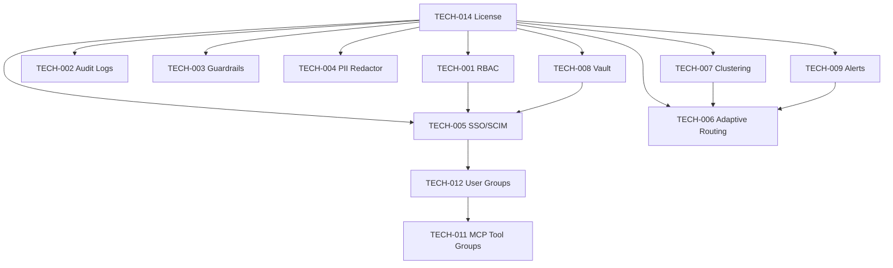

# Enterprise Feature Technical Design Index

**Version:** 1.0 | **Date:** 2026-04-08  
**References:** SRS v2.0, CR-ENT-001, CR-ENT-002, TDD-core.md, TDD-framework.md, TDD-plugins.md, TDD-transports.md

---

## Overview

Each file in this directory describes the complete technical design for one enterprise feature — including data models, Go interfaces, middleware integration points, API endpoints, and UI components — all anchored to the existing Bifrost architecture.

---

## File Index

| File | Feature | SRS Section | Primary Module | Priority |
|------|---------|-------------|----------------|----------|
| [TECH-001-rbac.md](TECH-001-rbac.md) | Role-Based Access Control | §3.12 | `transports/lib`, `framework/configstore` | P0 |
| [TECH-002-audit-logs.md](TECH-002-audit-logs.md) | Immutable Audit Logs | §3.13 | `framework/auditstore` (NEW) | P0 |
| [TECH-003-guardrails.md](TECH-003-guardrails.md) | Content Guardrails | §3.14 | `plugins/guardrails` (NEW) | P0 |
| [TECH-004-pii-redactor.md](TECH-004-pii-redactor.md) | PII Detection & Redaction | §3.15 | `plugins/piiredactor` (NEW) | P0 |
| [TECH-005-sso-scim.md](TECH-005-sso-scim.md) | SSO / SCIM 2.0 | §3.16 | `framework/oauth2`, `transports/handlers` | P1 |
| [TECH-006-adaptive-routing.md](TECH-006-adaptive-routing.md) | Adaptive Routing Engine | §3.17 | `plugins/adaptiverouting` (NEW) | P1 |
| [TECH-007-clustering.md](TECH-007-clustering.md) | Multi-Node Clustering | §3.18 | `framework/kvstore`, `framework/cluster` (NEW) | P1 |
| [TECH-008-vault.md](TECH-008-vault.md) | HashiCorp Vault Integration | §3.20 | `framework/vault` (NEW) | P1 |
| [TECH-009-alerts.md](TECH-009-alerts.md) | Alert Channels | §3.19 | `plugins/alerting` (NEW) | P1 |
| [TECH-010-large-payload.md](TECH-010-large-payload.md) | Large Payload Optimization | §3.21 | `core/network`, `framework/payloadstore` (NEW) | P2 |
| [TECH-011-mcp-tool-groups.md](TECH-011-mcp-tool-groups.md) | MCP Tool Groups | §3.22 | `core/mcp`, `framework/configstore` | P2 |
| [TECH-012-user-groups.md](TECH-012-user-groups.md) | User Groups | §3.23 | `framework/configstore`, `plugins/governance` | P2 |
| [TECH-013-connectors.md](TECH-013-connectors.md) | Data Connectors | §3.24 | `core/mcp/connectors` (NEW) | P2 |
| [TECH-014-license.md](TECH-014-license.md) | License Enforcement | §3.25 | `framework/license` (NEW) | P0 |

---

## New Go Modules Required

| Module Path | Purpose |
|-------------|---------|
| `plugins/guardrails` | Content moderation pipeline |
| `plugins/piiredactor` | PII detection and redaction |
| `plugins/adaptiverouting` | Real-time adaptive routing |
| `plugins/alerting` | Threshold-based alert notifications |

## New Framework Packages Required

| Package | Purpose |
|---------|---------|
| `framework/auditstore` | Append-only audit log persistence |
| `framework/vault` | HashiCorp Vault client |
| `framework/license` | JWT license validation |
| `framework/cluster` | Leader election + node registry |
| `framework/payloadstore` | Object storage for large payloads |
| `framework/scim` | SCIM 2.0 provisioning logic |

## New Transport Handlers Required

| Handler File | Routes |
|-------------|--------|
| `handlers/rbac.go` | `/api/rbac/*`, `/api/users/*` |
| `handlers/audit.go` | `/api/audit/*` |
| `handlers/guardrails.go` | `/api/guardrails/*` |
| `handlers/piiredactor.go` | `/api/pii/*` |
| `handlers/sso.go` | `/api/sso/*` |
| `handlers/scim.go` | `/scim/v2/*` |
| `handlers/cluster.go` | `/api/cluster/*` |
| `handlers/vault.go` | `/api/vault/*` |
| `handlers/alerting.go` | `/api/alerts/*` |
| `handlers/mcp_groups.go` | `/api/mcp/groups/*` |
| `handlers/user_groups.go` | `/api/user-groups/*` |
| `handlers/connectors.go` | `/api/connectors/*` |
| `handlers/license.go` | `/api/license/*` |

---

## New Database Tables (GORM AutoMigrate)

| Table | Module | Description |
|-------|--------|-------------|
| `roles` | TECH-001 | RBAC role definitions |
| `user_roles` | TECH-001 | User→Role assignments |
| `permissions` | TECH-001 | Permission matrix |
| `audit_logs` | TECH-002 | Immutable audit trail with hash chain |
| `guardrail_policies` | TECH-003 | Content moderation policies |
| `guardrail_violations` | TECH-003 | Policy violation log |
| `sso_configs` | TECH-005 | OIDC/SAML identity provider config |
| `external_users` | TECH-005 | Users provisioned via SSO/SCIM |
| `scim_tokens` | TECH-005 | SCIM API bearer tokens |
| `alert_rules` | TECH-009 | Alert rule definitions |
| `alert_state` | TECH-009 | Current firing/resolved state |
| `alert_history` | TECH-009 | Alert event history |
| `mcp_tool_groups` | TECH-011 | MCP tool group definitions |
| `mcp_tool_group_members` | TECH-011 | Tool→Group membership |
| `vk_mcp_groups` | TECH-011 | VK→MCPGroup assignments |
| `user_groups` | TECH-012 | User group definitions |
| `user_group_members` | TECH-012 | User→Group membership |
| `user_group_virtual_keys` | TECH-012 | Group→VK assignments |
| `connectors` | TECH-013 | Data connector configurations |

---

## Implementation Dependencies



---

## Plugin Execution Order (Final)

```
1. litellmcompat       (request normalization)
2. mocker              (test mock injection)
3. governance          (budget/rate-limit enforcement)
4. guardrails          (content moderation — TECH-003)
5. piiredactor         (PII redaction — TECH-004, MUST be before logging)
6. adaptiverouting     (routing decision — TECH-006)
7. semanticcache       (cache lookup)
8. logging             (request logging — sees redacted content)
9. telemetry           (Prometheus metrics)
10. otel               (distributed tracing)
11. alerting           (ObservabilityPlugin — async, TECH-009)
12. maxim              (Maxim observability)
13. jsonparser         (streaming JSON repair)
```

---

## Feature Flag Usage Pattern

Every enterprise feature must be gated with:

```go
import "github.com/maximhq/bifrost/framework/license"

if !license.IsFeatureEnabled("feature_name") {
    // Return 402 from handlers
    // Silently pass through from plugins
    return
}
```

Feature names correspond to TECH file feature IDs (lowercase):
`rbac`, `audit_logs`, `guardrails`, `pii_redactor`, `sso_oidc`, `sso_saml`, `scim`,
`adaptive_routing`, `clustering`, `alerts`, `vault`, `large_payload`,
`mcp_tool_groups`, `user_groups`, `data_connectors`
